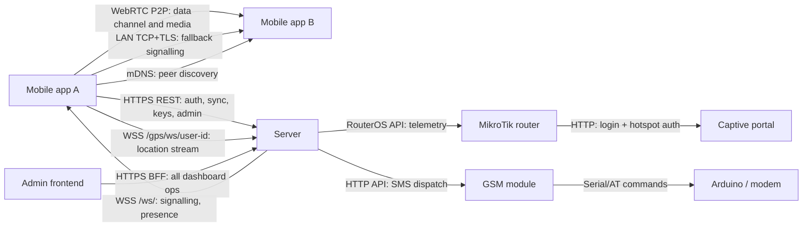

# SAPOT

SAPOT is a resilient communications platform for remote and disaster-affected areas. It helps teams communicate and coordinate through local networks, with messaging, voice and video calls, GPS sharing, administration tools, and SMS fallback when internet connectivity is unreliable or unavailable.

## What SAPOT provides

- **Local communication:** peer-to-peer messaging, voice calls, and video calls over the LAN.
- **Location awareness:** live GPS sharing for authorised users and an offline map for responders.
- **Resilient delivery:** SMS fallback through a GSM modem when a recipient is not reachable on the LAN.
- **Operational tools:** an administrator dashboard for user management, announcements, and network analytics.
- **Network access:** a MikroTik captive portal for users joining the local network.

## Architecture

SAPOT is LAN-first: its core communication functions are designed to operate without an internet connection. The server coordinates authentication, synchronisation, and call signalling, while chat data and call media travel directly between devices when possible.

For the full architecture, component boundaries, and communication matrix, see the [system overview](docs/architecture/system-overview.md).

## Components

| Component | Purpose |
|---|---|
| [Mobile app](mobile-app/sapot-mobile-app/) | Android application for messaging, calls, GPS sharing, announcements, and peer discovery. |
| [Server](server/) | FastAPI backend for authentication, sync, signalling, GPS, administration, and hardware integrations. |
| [Admin frontend](admin-frontend/sapot-admin/) | Web dashboard for user management, live GPS, announcements, and network analytics. |
| [GSM module](GSM-module/) | SMS gateway that controls a serial-attached GSM modem. |
| [Captive portal](captive-portal/) | MikroTik hotspot login pages for local-network access. |
| [Tileserver](tileserver/) | Offline map-tile deployment tooling for the GPS map. |

## Quick start

Follow the [full-stack quick start](docs/getting-started/quickstart.md) to run the server and mobile app on the same local network. It also links to optional setup for the GSM gateway and administrator dashboard.

## Documentation

- [Documentation index](docs/README.md)
- [Architecture](docs/architecture/)
- [Getting started](docs/getting-started/)
- [API reference](docs/api/README.md)
- [Deployment guides](docs/deployment/)
- [Troubleshooting](docs/TROUBLESHOOTING.md)

## Project information

- [Contributing guide](CONTRIBUTING.md)
- [Security policy](SECURITY.md)
- [Versioning guide](VERSIONING.md)
- [Changelog](CHANGELOG.md)
- [MIT License](LICENSE)
