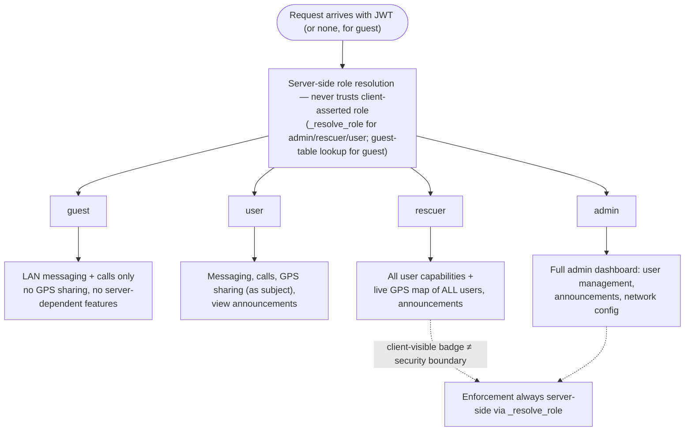

# Four-tier roles model: guest, user, rescuer, admin

**Status:** Accepted

## Context

SAPOT serves several distinct populations at an incident site: unregistered civilians who just joined the network, registered end users, professional rescuers who need situational awareness (live GPS of everyone), and administrators who manage the deployment itself. A permissions model was needed that lets civilians communicate immediately (registration is friction at a disaster scene) while still gating sensitive capabilities like live location tracking of all users and admin operations.

## Decision

Use a flat four-role model — `guest`, `user`, `rescuer`, `admin` — stored in `peers.role` (mobile WatermelonDB, added in schema v9) and resolved server-side, never from a client-asserted value. No custom/per-permission role system; role grants a fixed bundle of capabilities.

As implemented, resolution is split: the `_resolve_role` helper covers `admin`/`rescuer`/`user` (from the authenticated user's satellite role rows) and never returns `guest`; guest-ness is a separate server-side determination (a `guest` table row, surfaced per peer by `GET /keys/{peer_id}/type`). See [system-overview.md](../architecture/system-overview.md#roles) for the current mechanism.

Client-visible role badges (chat lists, message bubbles) are a UX/trust signal only — every capability above is re-checked server-side per request, never inferred from what the client displays.

## Consequences

- **Guests get full LAN messaging and calls with zero registration friction** — this is deliberate: at a disaster scene, requiring account creation before someone can call for help is unacceptable. The cost is that guests cannot be identified or held accountable, and cannot share GPS or access server-dependent features (see the role table in [system-overview.md](../architecture/system-overview.md#roles)).
- **`rescuer` is the only role with live GPS visibility into all users**, keeping that surface — which is sensitive (see [threat-model.md](../architecture/threat-model.md#insider-threat-lan)) — restricted to a small, presumably-vetted population rather than exposed to every authenticated user.
- **Flat roles, no fine-grained permission system.** This keeps the authorization model simple to reason about and audit (four cases everywhere, not an open-ended permission matrix), at the cost of flexibility — there is no way to grant a `user` a single rescuer-like capability (e.g. "can see GPS for one specific team") without promoting them to `rescuer` outright.
- **Role is client-visible** — displayed as a badge in chat lists and message bubbles (see [system-overview.md](../architecture/system-overview.md#roles)) — which is a UX/trust signal, not a security boundary; enforcement happens server-side via `_resolve_role`, never trusting a client-asserted role.
