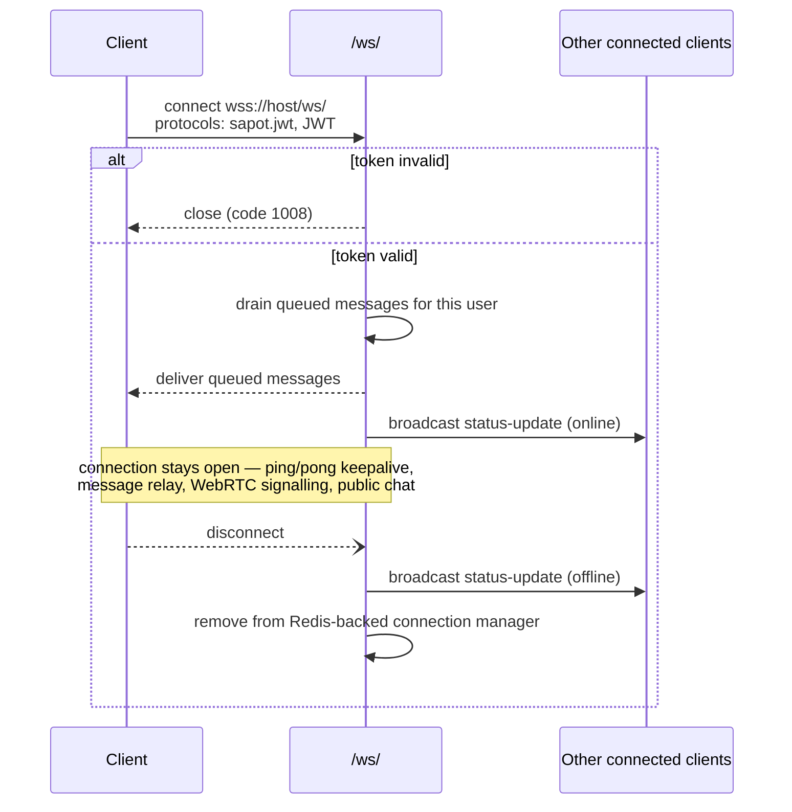
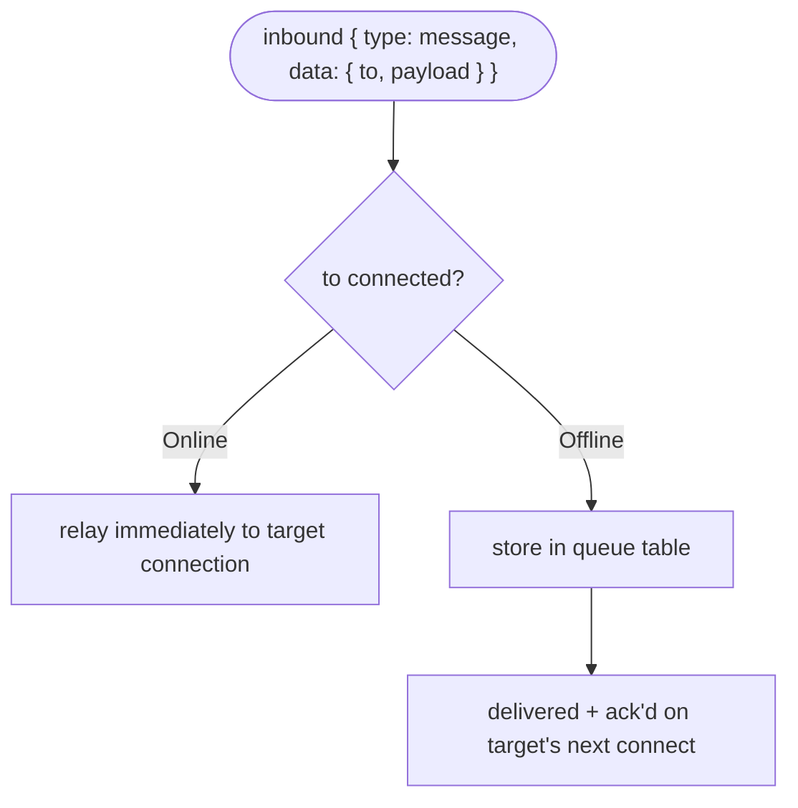

# Messaging and WebSocket API

Machine-readable spec: [`openapi/messaging-and-websocket.yaml`](openapi/messaging-and-websocket.yaml) (generated from the live FastAPI app — REST routes only; the `/ws/` WebSocket route is not representable in OpenAPI and is documented in prose below).

## Endpoints at a glance

| Method | Path | Auth | Summary |
|---|---|---|---|
| WS | `/ws/` | `Sec-WebSocket-Protocol: sapot.jwt, <JWT>`; optional `target_id` | Real-time hub: chat relay, WebRTC signalling, presence, public chat. |
| GET | `/public-chat` | JWT Bearer | Paginated public chat history. Query params: `limit` (default 100), `before` (created_at cursor, epoch ms). |

## Overview

The main WebSocket endpoint `/ws/` is the real-time hub for:
- Chat message relay (encrypted blobs between peers)
- WebRTC signalling (SDP offer/answer, ICE candidates)
- Presence (online/offline status broadcasts)
- Public chat

The server does **not** read message content — it relays encrypted blobs. The mobile app applies NaCl box encryption before sending.

---

## WebSocket /ws/

**Auth:** ordered WebSocket subprotocol offer `sapot.jwt`, then the access token

```javascript
const socket = new WebSocket("wss://<host>/ws/", ["sapot.jwt", accessToken]);
const targetedSocket = new WebSocket("wss://<host>/ws/?target_id=<uuid>", [
  "sapot.jwt",
  accessToken,
]);
```

**On connect:**
1. The subprotocol offer and token are validated; the server selects `sapot.jwt`. Invalid or ambiguous offers close with code 1008.
2. Queued messages for this user are drained and delivered.
3. A `status-update` broadcast (`online`) is sent to all connected users.

**On disconnect:**
1. A `status-update` broadcast (`offline`) is sent.
2. Connection is removed from the Redis-backed connection manager.



**Inbound message routing (online vs. offline target):**



---

### Inbound message types (client to server)

#### ping

Keepalive — server responds with `pong`.

```json
{ "type": "ping" }
```

#### get-active-users

Request the list of currently connected user IDs.

```json
{ "type": "get-active-users" }
```

#### Message relay

Send an encrypted message to another user. Relayed immediately if the target is online, otherwise queued in the `queue` table for delivery on next connection.

```json
{
  "type": "message",
  "data": {
    "to": "<target_user_uuid>",
    "type": "message",
    "payload": "<encrypted_blob>"
  }
}
```

#### Acknowledgement

Acknowledge a delivered queued message so it is removed from the queue.

```json
{
  "type": "ack",
  "data": { "queue_id": "<uuid>" }
}
```

#### WebRTC signalling

Relay SDP offer, answer, or ICE candidate to another peer. Not queued if the target is offline.

```json
{
  "type": "offer",
  "from_user": "<sender_uuid>",
  "to": "<target_uuid>",
  "data": { "sdp": "..." }
}
```

```json
{
  "type": "answer",
  "from_user": "<sender_uuid>",
  "to": "<target_uuid>",
  "data": { "sdp": "..." }
}
```

```json
{
  "type": "ICE",
  "from_user": "<sender_uuid>",
  "to": "<target_uuid>",
  "data": { "candidate": "..." }
}
```

The server validates that `from_user` matches the authenticated user.

#### Public chat

Broadcast a message to all connected users.

```json
{
  "type": "public-chat",
  "data": {
    "content": "Hello everyone",
    "sender_id": "<uuid>"
  }
}
```

---

### Outbound message types (server to client)

| Type | Trigger | Payload |
|---|---|---|
| `pong` | Response to ping | `{ "type": "pong" }` |
| `status-update` | User connects/disconnects | `{ "type": "status-update", "user_id": "<uuid>", "status": "online" }` |
| `active-users` | Response to get-active-users | `{ "type": "active-users", "users": ["<uuid>"] }` |
| `message` | Relayed chat message | Same payload as inbound message relay |
| `offer` / `answer` / `ICE` | Relayed WebRTC signal | Same payload as inbound signalling |
| `public-chat` | Broadcast public message | `{ "type": "public-chat", "data": { ... } }` |

---

## GET /public-chat

Retrieve public chat history.

**Auth:** JWT Bearer

**Query params:**
- `limit` (default `100`) — max messages to return
- `before` (optional) — return messages created before this `created_at` value, for pagination

**Response 200:**
```json
{
  "messages": [
    {
      "id": "<uuid>",
      "content": "Hello everyone",
      "is_deleted": false,
      "sender_id": "<uuid>",
      "sender_first_name": "Jane",
      "sender_last_name": "Doe",
      "sender_username": "jdoe",
      "created_at": 1751414400000
    }
  ],
  "limit": 100,
  "oldest_created_at": 1751414400000
}
```

Only non-deleted messages with `conversation_id IS NULL` (i.e. public-chat messages, not 1:1/DM) are returned, most recent first.
