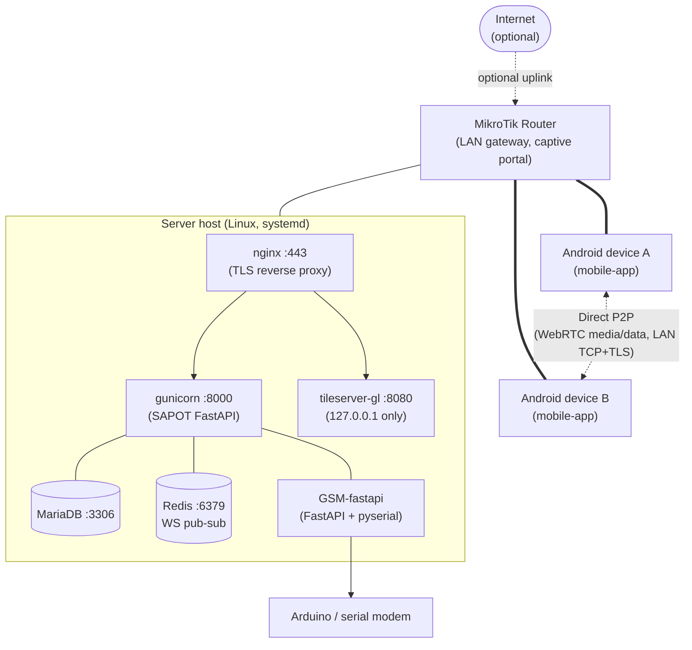

# Component Map

## Runtime topology

```
Internet (optional — not required for core operation)
     |
MikroTik Router (LAN gateway + captive portal)
     |
     +--- Wi-Fi / Ethernet LAN
              |
    +---------+----------+
    |                    |
Android devices     Server host (Linux, systemd)
(mobile-app)             |
    |                    +-- [nginx :443] (TLS reverse proxy)
    |                    |        |
    |                    |        +-- [gunicorn :8000] (SAPOT FastAPI)
    |                    |        |          |
    |                    |        |          +-- [MariaDB :3306]
    |                    |        |          |
    |                    |        |          +-- [Redis :6379] (WS pub-sub)
    |                    |        |
    |                    |        +-- [tileserver-gl :8080, 127.0.0.1 only]
    |                    |
    |                    +-- [GSM-API] (FastAPI + pyserial -> Arduino/modem)
    |
    +--- Direct P2P (WebRTC media/data, LAN TCP+TLS)
         to other Android devices on the same LAN
```



For the security trust boundaries overlaid on this same topology (which zones are trusted vs. semi-trusted), see [threat-model.md](threat-model.md#trust-boundaries).

---

## Services and ports

| Service | Process | Listens | Proxied by |
|---|---|---|---|
| SAPOT FastAPI server | `gunicorn` + `uvicorn` workers | `127.0.0.1:8000` | Nginx `:443` |
| Nginx reverse proxy | `nginx` | `0.0.0.0:443` (TLS), `:80` (redirect) | — |
| MariaDB | `mysqld` | `127.0.0.1:3306` | — (server-internal) |
| Redis | `redis-server` | `127.0.0.1:6379` | — (server-internal) |
| GSM module API | `uvicorn` (`GSM-fastapi/main.py`) | `127.0.0.1:8001` (hardcoded, `PORT` var has no effect) | — (see [environment-config.md](../deployment/environment-config.md#gsm-module-gsm-modulegsm-fastapi)) |
| Tileserver | `tileserver-gl` | `127.0.0.1:8080` | Nginx `:443` at `/tiles/` (see [tileserver.md](../deployment/tileserver.md)) |
| Admin frontend | `next start` | `127.0.0.1:3000` | Nginx (see [admin-frontend.md](../deployment/admin-frontend.md)) |

---

## Nginx routing

| Path | Upstream | Notes |
|---|---|---|
| `/ws/` | `http://127.0.0.1:8000` | WebSocket — no proxy read timeout (86400 s) |
| `/static/` | Filesystem | Served directly by Nginx; 30-day cache |
| `/tiles/` | `http://127.0.0.1:8080` | Tileserver; prefix stripped by trailing `/` on `proxy_pass` |
| `/` (all other) | `http://127.0.0.1:8000` | Standard proxy; 135 s read timeout |

HTTP (port 80) redirects to HTTPS with 301.

---

## systemd services (known)

| Unit | Component |
|---|---|
| `server-main-api.service` | SAPOT FastAPI server |
| `server-GSM-api.service` | GSM module API |
| `tileserver.service` | Offline tile server |

> **Note:** Verify exact unit names from `deployment-scripts/` or the server directory.

---

## Mobile app connectivity

| Protocol | Target | Purpose |
|---|---|---|
| HTTPS | Server (via Nginx) | REST API calls |
| WSS | Server `/ws/` | Signalling, presence, message relay |
| WSS | Server `/gps/ws/` | GPS streaming |
| WebRTC (P2P) | Other devices | Voice/video calls, data channel |
| LAN TCP + TLS | Other devices | Direct peer messaging |
| mDNS / Zeroconf | LAN broadcast | Peer discovery |

See [data-flow.md](data-flow.md) for detailed message and call flows.
