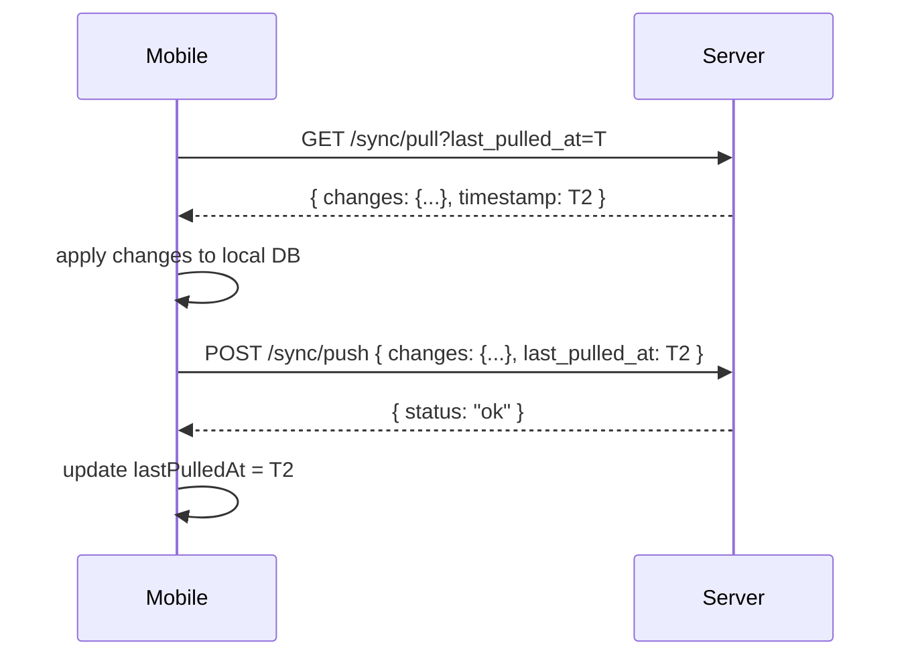
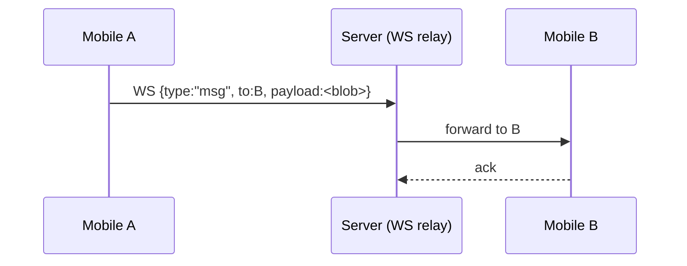
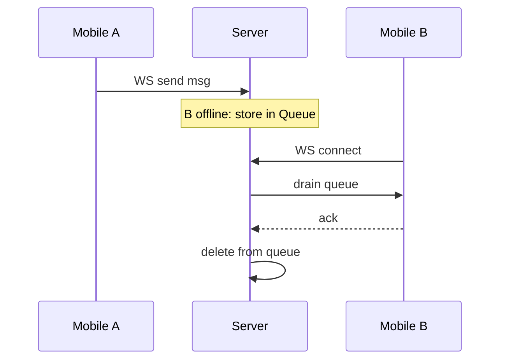
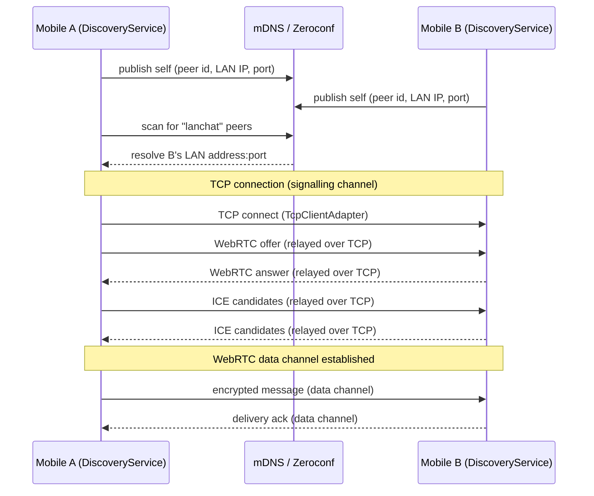
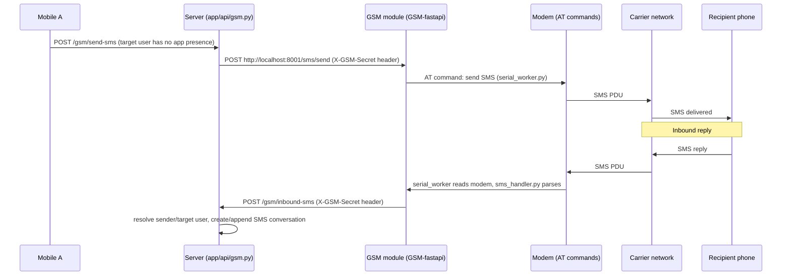
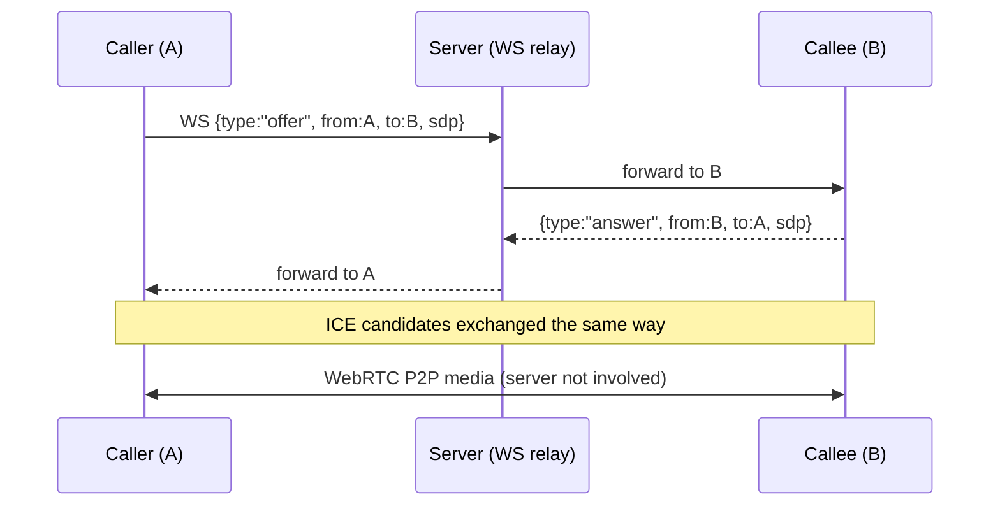
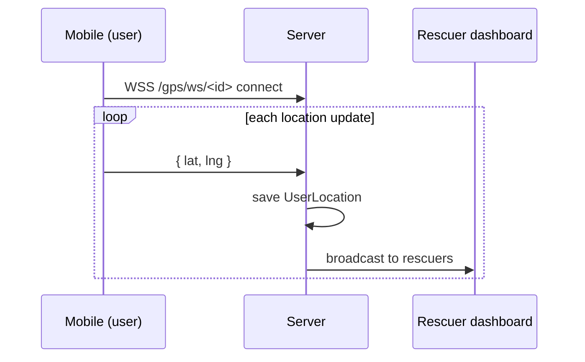

# Data Flows

This document describes the key data flows in SAPOT. For the communication matrix see [system-overview.md](system-overview.md). For service topology see [component-map.md](component-map.md).

---

## 1. Sync flow (pull then push)

The mobile app (WatermelonDB) syncs with the server in two phases.

- Initial sync: `last_pulled_at=0` returns all non-deleted records.
- Incremental: returns only records with `updated_at > last_pulled_at`.
- Conflict: if server record `updated_at > last_pulled_at`, push returns 409.
- Message rows are pushed independently of delivery receipts, so pending or
  failed peer delivery still has a durable server-side history copy.
- `SENDING` and `NOT_SENT` receipts remain local and are kept dirty for retry;
  `SENT`, `DELIVERED`, and `READ` receipts are synced.

Tables synced: `conversations`, `messages`, `conversation_participants`, `calls`, `call_participants`, `message_receipts`.

See [api/sync.md](../api/sync.md) and [mobile-app docs SYNC.md](../../mobile-app/sapot-mobile-app/docs/SYNC.md).

---

## 2. Message delivery flow

### Path A: Peer online (WebSocket relay)

### Path B: Peer offline (queue + drain on reconnect)

### Path C: LAN direct (mDNS discovery + TCP + WebRTC data channel)

Devices on the same WiFi network can message each other directly with no server involvement, using the `lan` transport mode. See [mobile-app docs LAN_MESSENGER.md](../../mobile-app/sapot-mobile-app/docs/LAN_MESSENGER.md) and [ARCHITECTURE.md](../../mobile-app/sapot-mobile-app/docs/ARCHITECTURE.md) for full implementation detail.

Key constraints of `lan` mode:
- No WebSocket relay is used or allowed — message send throws if no data channel is open (`"No data channel and WS not allowed in lan mode"`).
- Zeroconf publish/scan is only enabled when `effectiveMode === "lan" || "auto"`.
- On `peer-reconnected` (WebRTC data channel reopens), `DiscoveryService` triggers a retry of any message left in `NOT_SENT` status.

### SMS fallback

If the recipient cannot be reached over LAN or WS, the server relays the message as an SMS via the GSM module (serial-attached GSM modem). This is one-directional per hop (mobile → non-app recipient, and SMS reply → mobile app user), not a substitute for the encrypted transports above — SMS content is plaintext at the GSM module.

The server and GSM module authenticate each other with a shared `GSM_SECRET` header (`X-GSM-Secret`), not a user session token — see [environment-config.md](../deployment/environment-config.md).

---

## 3. Call signalling flow (WebRTC)

The server relays only small SDP/ICE negotiation messages. It never carries media.

See [mobile-app docs CALL_FLOW.md](../../mobile-app/sapot-mobile-app/docs/CALL_FLOW.md).

---

## 4. GPS streaming flow

REST: `GET /gps/latest` and `GET /gps/history/{user_id}` serve the initial map load and historical path.
