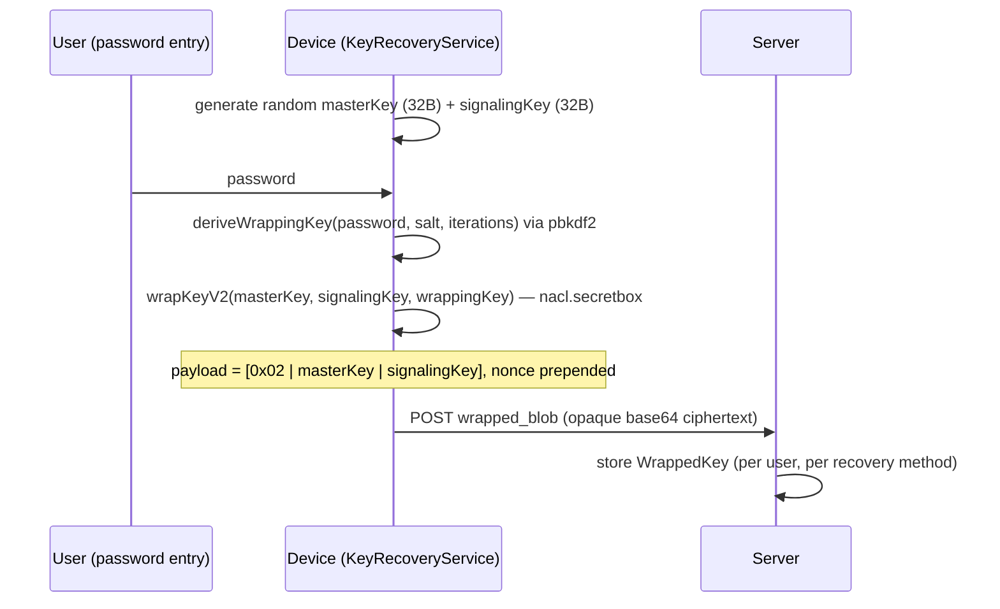
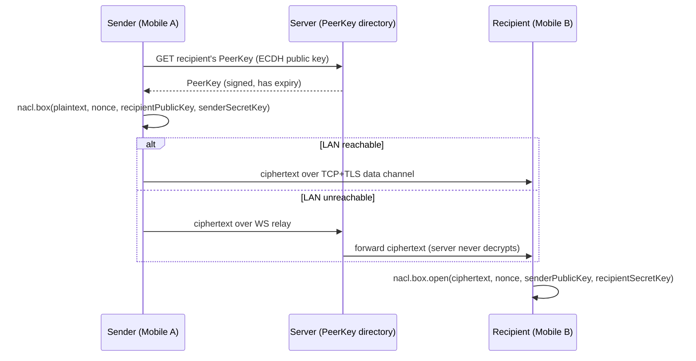
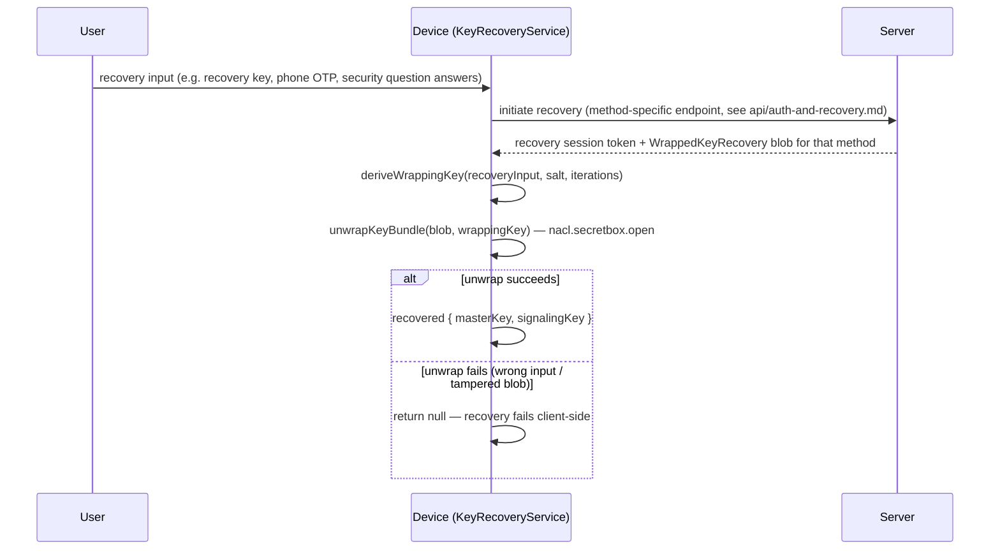

# Security Architecture

---

## Authentication: JWT tokens

The server uses a dual-token system (access + refresh):

- **Access token**: Short-lived JWT. Used in `Authorization: Bearer` header. Subject (`sub`) is the user UUID.
- **Refresh token**: Longer-lived JWT. Exchanged at `POST /auth/refresh` for a new token pair.
- **JTI blacklist**: Logout adds the token's `jti` claim to `BlacklistedToken`. Token validation checks this table.
- **Re-auth token**: Short-lived token from `POST /auth/reauthenticate` after password verification. Gates sensitive operations.

JWT signing uses `PyJWT`. Token expiry constants are in `db_operations/token.py`.

---

## Password hashing

Passwords are hashed with **Argon2** via `pwdlib`'s `Argon2Hasher` (`server/app/db_operations/auth.py`). Plain text passwords are never stored or logged.

---

## Login lockout

See [features/authentication/design.md](../features/authentication/design.md#login-lockout) for the
canonical `login_attempt` schema, budget/cooldown values, and phantom-budget mechanism.

---

## E2E encryption: key management

SAPOT uses NaCl box (ECDH + XSalsa20-Poly1305) for message content. The server cannot read message content.

**Key hierarchy:**
- **Peer key** (`PeerKey`): Per-user ECDH public key on the server; has expiry and server signature. Private key never leaves the device.
- **Device key** (`DeviceKey`): Public key bound to a device fingerprint.
- **Wrapped master key** (`WrappedKey`): User's master key, encrypted with a password-derived key. Server stores the opaque encrypted blob.
- **Wrapped key recovery** (`WrappedKeyRecovery`): Copies of the wrapped master key, one per recovery method.
- **Contact key** (`ContactKey`): Encrypted public keys for non-registered (guest) peers.

All wrapping and unwrapping is done client-side. The server stores and retrieves opaque blobs only.

See [mobile-app/sapot-mobile-app/docs/ARCHITECTURE.md](../../mobile-app/sapot-mobile-app/docs/ARCHITECTURE.md) for implementation details.

### Device/master key setup (password → wrapped key)

Master key generation and wrapping (`KeyRecoveryService.wrapKeyV2`) happens entirely on-device. The server only ever stores the resulting ciphertext.

- `KeyRecoveryService.ITERATIONS` varies by recovery method (`password`: 200k, `phone`: 200k, `email`: 100k, `qa`: 300k, `token`: 100k).
- V2 payload layout: `1-byte version (0x02) | 32-byte masterKey | 32-byte signalingKey`; legacy V1 wraps a bare 32-byte master key.
- Additional `WrappedKeyRecovery` rows store the same master key wrapped under a different derived key per recovery method (phone/email/security-question/token), so any one method can independently unwrap it.

### Message encryption (NaCl box, transport-agnostic)

Encryption is identical whether the message travels the P2P LAN path or the server-relay (WS) path — the server only ever sees ciphertext either way. See [message delivery flow](data-flow.md#2-message-delivery-flow).

### Recovery key unwrap

The server never learns the recovery input (password, security answers, etc.) or the recovered master key — it only issues the recovery session token and returns the opaque wrapped blob.

---

## Rate limiting

`slowapi` rate limits are applied at the endpoint level. See [api/conventions.md](../api/conventions.md).

---

## LAN transport security

Mobile-to-mobile direct messaging uses **LAN TCP + TLS** (`react-native-tcp-socket`). Messages are also E2E-encrypted at the application layer.

Nginx enforces **TLS 1.2/1.3** with `HIGH:!aNULL:!MD5` cipher suite.

---

## Known security concerns

See [SECURITY.md](../../SECURITY.md) at the repo root for the canonical, up-to-date list of resolved and outstanding security gaps — do not duplicate that table here.

---

## Threat model

See [threat-model.md](threat-model.md) for attack surfaces in scope, LAN trust assumptions, physical access scenarios (device theft, router compromise), insider threats, and risks from the E2E encryption design.
