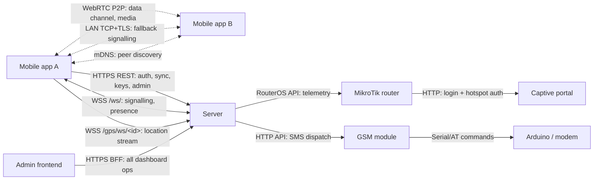

# System Overview

SAPOT is a local-first disaster-response communications platform. It is designed to operate entirely on a local-area network (LAN) managed by a MikroTik router, with no dependency on internet connectivity for its core functions.

---

## Design Principles

- **Offline-first.** Messaging, calls, peer discovery, and GPS sharing all function on the LAN without internet. See [ADR 0005](../adr/0005-lan-first-design.md).
- **Local database.** The mobile app maintains a full local copy of relevant data in WatermelonDB (SQLite). Sync with the server is incremental and resumable. See [ADR 0003](../adr/0003-watermelondb-for-mobile-local-database.md).
- **P2P media.** Voice and video calls are WebRTC peer-to-peer. The server relays only the SDP and ICE signalling messages; it never carries call media. See [ADR 0004](../adr/0004-p2p-calls-with-signalling-relay.md).
- **End-to-end encryption.** Messages are encrypted at rest and in transit using NaCl box (ECDH key agreement, per-conversation keys). The server cannot read message content. See [ADR 0001](../adr/0001-nacl-box-for-e2e-encryption.md).
- **SMS fallback.** If a recipient is not reachable on the LAN, the GSM module sends an SMS via an Arduino-controlled modem.

---

## Components and Responsibilities

### Mobile App (`mobile-app/sapot-mobile-app/`)

The primary user-facing component. An Expo/React Native Android app.

**Responsibilities:**
- Peer-to-peer messaging over WebRTC data channels (LAN) or LAN TCP+TLS
- Voice and video calls (WebRTC P2P; server relays signalling only)
- LAN peer discovery via Zeroconf/mDNS
- Live GPS location sharing (rescuers only; streamed over a dedicated WebSocket to the server)
- Server-fetched announcements (role-filtered, expiry-aware)
- Local database (WatermelonDB/SQLite) with incremental pull/push sync
- End-to-end encryption (NaCl box, per-conversation ECDH keys, at-rest encryption)
- Guest-to-authenticated account migration
- Background WebSocket connectivity maintenance (Android background task)

**Key dependencies:** Expo Router, `react-native-webrtc`, `react-native-tcp-socket` (TLS), `react-native-zeroconf`, WatermelonDB, `tweetnacl`, `expo-secure-store`, `@maplibre/maplibre-react-native`.

See [mobile-app/sapot-mobile-app/docs/ARCHITECTURE.md](../../mobile-app/sapot-mobile-app/docs/ARCHITECTURE.md) for the full service map, DI wiring, and encryption details.

---

### Server (`server/`)

The FastAPI backend. Deployed as a Gunicorn process behind an Nginx reverse proxy.

**Responsibilities:**
- Authentication and session management (PyJWT, pwdlib)
- WebSocket signalling relay for WebRTC negotiation
- Incremental sync endpoint (`GET /sync/pull`, `POST /sync/push`)
- GPS location ingest and relay (WebSocket per user)
- User management (registration, email verification, password reset, profile pictures)
- Public key distribution for peer encryption key exchange
- Admin operations (user suspension, announcements, role management)
- MikroTik router telemetry collection (RouterOS API)
- SMS dispatch proxy (delegates to the GSM module via HTTP)
- Captive portal integration
- Activity logging (JSON + text rotating log files; DB write for mutating requests)
- Rate limiting via `slowapi`
- Announcement lifecycle management (background expiry loop)
- Router metrics collection (background polling loop)

**Key dependencies:** FastAPI 0.128, Uvicorn/Gunicorn, SQLModel 0.0.31 + SQLAlchemy 2.0, PyMySQL (MariaDB), `redis.asyncio` (pub-sub for WebSocket fan-out), `RouterOS-api`, pyserial, PyJWT, pwdlib, slowapi, fastapi-pagination, Sentry SDK.

**Internal structure:** `api/` routers → `db_operations/` service layer → `models/`.

API routers: `admin`, `auth`, `captive_portal`, `download`, `forgot_password`, `gps`, `gsm`, `keys`, `mikrotik`, `peer_connection`, `ping`, `profile_picture`, `public_chat`, `sync`, `testing` (dev only), `update_info`, `user_keys`, `user_utils`, `verify_email`, `wrapped_key`.

> Note: The `testing` router is included in production builds as of the current codebase (`# delete when going to production` comment in `main.py`). It should be removed before a public deployment.

---

### Admin Frontend (`admin-frontend/sapot-admin/`)

A Next.js App Router web application for admins and rescuers.

**Responsibilities:**
- User dashboard (user list, roles, suspension)
- Live GPS map (rescuer view, powered by offline tileserver)
- Network analytics (MikroTik interface traffic, router health)
- Announcement management

**Architecture:** Next.js server components and server actions act as a Backend-for-Frontend (BFF), proxying requests to the FastAPI server. Client-side encryption is applied where needed. Route handlers are used for streaming or long-poll endpoints.

---

### GSM Module (`GSM-module/`)

A hardware SMS gateway.

**Responsibilities:**
- Exposes an HTTP API consumed by the SAPOT server
- Controls an Arduino (or direct serial modem) via pyserial using AT commands
- Sends outbound SMS messages to phone numbers when LAN delivery is not possible

**Stack:** FastAPI, pyserial.

---

### Captive Portal (`captive-portal/`)

Static login pages hosted by the MikroTik router.

**Responsibilities:**
- Shown to users when they first join the SAPOT Wi-Fi network
- Authenticates users against the MikroTik user database (or delegates to the SAPOT server)
- Grants network access on success

**Stack:** Static HTML, CSS, JavaScript. Served by MikroTik's built-in hotspot feature.

---

### Tileserver (`tileserver/`)

An offline map tile server.

**Responsibilities:**
- Serves raster or vector map tiles for the GPS map in the admin frontend and mobile app
- Operates without internet; tiles are pre-loaded onto the server

> Note: Technology stack and tile format (e.g. MBTiles, PMTiles) need verification.

---

## Communication Matrix

| Source | Destination | Protocol / Channel | Purpose |
|---|---|---|---|
| Mobile app | Server | HTTPS REST | Auth, sync pull/push, user search, key exchange, profile pictures, announcements, admin actions |
| Mobile app | Server | WSS WebSocket (`/ws/`) | WebRTC signalling (SDP/ICE relay), presence, active-users |
| Mobile app | Server | WSS WebSocket (`/gps/ws/<userId>`) | Live GPS location streaming |
| Mobile app | Mobile app | WebRTC P2P (data channel) | Chat messages |
| Mobile app | Mobile app | WebRTC P2P (media) | Voice and video call audio/video streams |
| Mobile app | Mobile app | LAN TCP + TLS | Signalling over direct peer connection (when WS unavailable); planned fallback for chat |
| Mobile app | Mobile app | mDNS (Zeroconf) | LAN peer discovery, address updates |
| Admin frontend | Server | HTTPS (Next.js BFF) | All dashboard operations |
| Server | MikroTik router | RouterOS API | Interface traffic, router health metrics |
| Server | GSM module | HTTP API | SMS dispatch requests |
| GSM module | Arduino / modem | Serial (pyserial, AT commands) | AT command execution for SMS |
| MikroTik router | Captive portal | HTTP (internal) | Login page serving and hotspot auth |

> This diagram is a protocol-level view (who talks to whom, over what channel, and why). For the physical/deployment topology (hosts, ports, processes), see [component-map.md](component-map.md).

---

## Roles

| Role | Description | Key Permissions |
|---|---|---|
| `admin` | System administrator | Full admin dashboard access, user management, announcements, network config |
| `rescuer` | Emergency responder | Live GPS map (all users), announcements, all communication features |
| `user` | Authenticated end user | Messaging, calls, GPS sharing with rescuers, view announcements |
| `guest` | Unauthenticated user | LAN messaging and calls only; no GPS sharing; no server-dependent features |

Role is stored in `peers.role` (WatermelonDB, schema v9+) and server-side. The server's `_resolve_role` helper resolves the effective role from the JWT. Role is displayed as a badge in chat lists and message bubbles. See [ADR 0006](../adr/0006-four-tier-roles-model.md) for why this flat four-role model was chosen over a fine-grained permission system.

---

## System Boundaries

- The server **never reads message content**. Sync endpoints store and return encrypted blobs. The server is not in the message delivery path for P2P chat.
- The server **never carries call media**. It relays only the small SDP offer/answer and ICE candidate messages needed to establish the direct WebRTC connection.
- The mobile app's **local database is the primary source of truth** for messages. The server holds a synchronized copy for cross-device continuity and history, not as the write-primary.
- The GSM module is a **thin gateway**. The SAPOT server decides when to send SMS; the GSM module only translates the HTTP request to AT commands.
- The admin frontend has **no direct database access**. All data access goes through the FastAPI server.

---

See [threat-model.md](threat-model.md) for attack surfaces in scope, trust boundaries, and known risks (insider threat on the LAN, physical access to the router, device theft, E2E encryption design risks).

See [deployment/runbooks.md](../deployment/runbooks.md#disaster-recovery-server-hardware-fails-at-incident-site) for the fallback procedure if the server hardware fails at an incident site.

> **TODO (human input required):** Document disaster-scenario operating constraints not yet captured elsewhere — expected number of concurrent users and expected geographic area / radio range assumptions.
