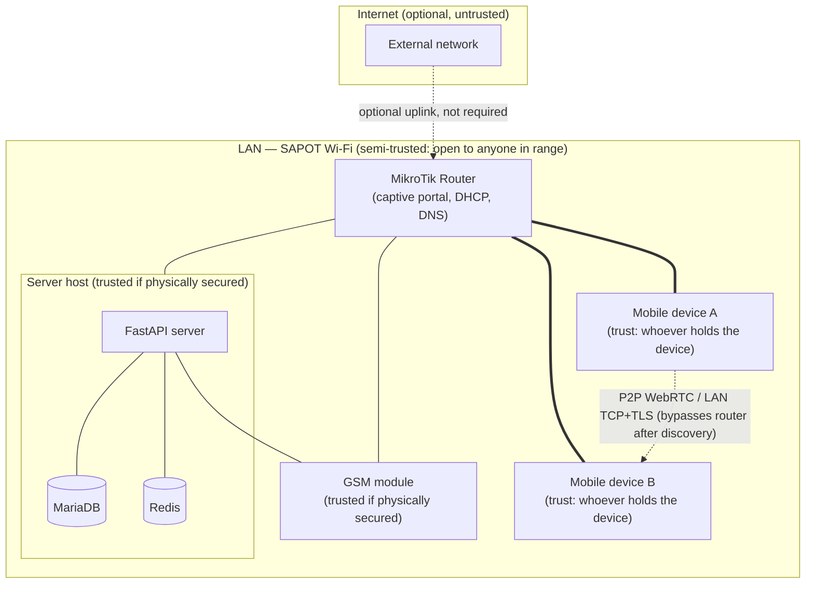

# Threat Model

SAPOT is deployed at disaster-response incident sites: a MikroTik router creates a standalone LAN, a laptop/server runs the FastAPI backend, and rescuers/civilians join with Android phones running the mobile app. This document defines the trust boundaries, in-scope attack surfaces, and known risks for that deployment shape.

This is the canonical threat-model document. [system-overview.md](system-overview.md#system-boundaries) and [security-architecture.md](security-architecture.md#threat-model) link here instead of duplicating it.

---

## Deployment context and assumptions

- **No internet dependency.** The LAN is self-contained; there is no upstream firewall or cloud WAF protecting it.
- **Physical access is loosely controlled.** Incident sites are not secured facilities — anyone within Wi-Fi range, or anyone who can walk up to the router/server hardware, is a potential adversary.
- **Users are not vetted.** `guest` role requires no registration; any device that joins the Wi-Fi network can message and call other devices on the LAN.
- **The deployment window is short** (hours to days per incident), which shifts priorities toward availability and simplicity over defense-in-depth measures that assume long-lived infrastructure (e.g. certificate authorities, HSMs, SIEM).

---

## Trust boundaries

**Boundary 1 — LAN perimeter.** Everything inside the SAPOT Wi-Fi network is one broadcast domain. There is no VLAN segmentation between rescuer devices, civilian devices, and server infrastructure by default (see [Known risks](#known-risks-and-accepted-tradeoffs)).

**Boundary 2 — Server host.** The FastAPI process, MariaDB, and Redis are collocated on one host and trusted as a unit. A compromise of the server process is a compromise of the DB and Redis (they are not network-isolated from each other in the current deployment).

**Boundary 3 — Device trust.** Each mobile device is trusted only as far as its holder. A stolen or seized device is a full compromise of that device's local data (see [Device theft](#device-theft)) but does **not**, by design, compromise other users' message content (see [E2E encryption design risks](#e2e-encryption-design-risks)).

**Boundary 4 — Router.** The MikroTik router is both the network's gateway and its captive-portal authenticator. It is a single point of control for the whole LAN (see [Router compromise](#router-compromise)).

---

## Attack surfaces in scope

| Surface | Description |
|---|---|
| FastAPI REST/WebSocket endpoints | Reachable by any device on the LAN once it has network access (before or after captive-portal auth, depending on router config) |
| WebRTC signalling relay (`/ws/`) | Relays SDP/ICE between arbitrary peers; a malicious client could attempt to inject signalling for peers it doesn't own |
| LAN P2P transport (WebRTC data channel, TCP+TLS) | Direct device-to-device; any device on the LAN can attempt to connect to any other device's listening socket |
| mDNS/Zeroconf discovery | Broadcasts peer presence and connection info on the LAN; unauthenticated by design (mDNS has no auth mechanism) |
| Captive portal | The first thing an unauthenticated device interacts with; controls initial network admission |
| Admin frontend | Higher-privilege surface — user management, announcements, network config |
| GSM service HTTP boundary (`/sms/send`, `/gsm/inbound`) | Authenticated in both directions via shared secret (`GSM_SECRET`/`X-GSM-Secret`); reachable from the server and the GSM module's network segment |
| MariaDB, Redis | Server-internal; in scope only via server compromise (not directly LAN-reachable in the documented deployment) |

## Attack surfaces explicitly out of scope

- Physical security of the incident site (crowd control, guarding the router/server hardware) — organizational, not technical.
- RouterOS/MikroTik firmware vulnerabilities — treated as a trusted third-party dependency; patch per vendor advisories.
- Android OS-level compromise (rooted device, malicious app with device-owner privileges) — the app can only defend against threats within its own sandbox.
- Supply-chain compromise of npm/PyPI dependencies — mitigated by normal dependency-review practice, not modeled here.

---

## Threat scenarios

### Device theft

**Scenario:** A rescuer's or user's phone is lost, stolen, or seized while the SAPOT app is installed and logged in.

- **What the attacker gets:** Local WatermelonDB contents (message history, contacts, cached GPS) if the device is unlocked or the OS-level disk encryption is bypassed; the ability to send/receive as that user until the session is revoked. The master encryption key is derived from the user's password/recovery method and, once unwrapped on-device, held in memory/secure storage — see [key hierarchy](security-architecture.md#e2e-encryption-key-management).
- **Mitigations already in place:** Tokens live in `expo-secure-store` (hardware-backed on Android), not `AsyncStorage`. `POST /auth/logout` blacklists the JWT `jti`, revoking server-side access immediately if the operator can reach the endpoint (e.g. via the admin dashboard's "suspend user" action, which is independent of the stolen device).
- **Gaps:** There is no remote-wipe capability, no device-list/session-list UI for a user to revoke a specific device's access, and no automatic re-lock timer inside the app (relies entirely on the OS lock screen). A thief with a device already unlocked at time of theft has an unbounded window until an admin manually suspends the account.

### Router compromise

**Scenario:** An attacker gains admin access to the MikroTik router (default credentials, exposed management interface, or physical console access).

- **What the attacker gets:** Full control of the LAN — can redirect DNS, intercept unencrypted traffic, deny service to legitimate devices, or manipulate the captive portal to phish credentials.
- **Mitigations already in place:** Message content is E2E-encrypted (NaCl box) regardless of transport, so a router-level MITM cannot read chat content even with full traffic visibility. TLS 1.2/1.3 (`HIGH:!aNULL:!MD5`) protects REST/WebSocket traffic to the server from passive sniffing; the mobile app pins the server's self-signed certificate at build time (see [secrets-management.md](../deployment/secrets-management.md#tls-certificate)), which limits (but does not eliminate — see below) active MITM against the server API.
- **Gaps:** Router credentials/hardening are not currently documented or enforced anywhere in this repo (no ADR, no runbook). A compromised router can still deny service, delay/drop signalling (degrading call setup), and — because certificate pinning only protects connections after the app is built with the pinned cert baked in — could attempt to intercept a device's very first connection if the pinned cert itself is ever wrong or rotated without a corresponding app rebuild.

### Insider threat (LAN)

**Scenario:** A legitimate `guest` or `user` on the LAN acts maliciously — attempts to read others' messages, impersonate another peer, or disrupt service.

- **Read others' messages:** Not possible via network access alone — content is E2E-encrypted per-conversation with keys never leaving the device (see [message encryption flow](security-architecture.md#message-encryption-nacl-box-transport-agnostic)). An insider on the LAN sees ciphertext whether they sniff the P2P TCP channel or the WS relay.
- **Impersonate a peer:** Requires either the target's private key (device compromise) or exploiting a gap in `PeerKey` distribution/verification. `PeerKey` records are optionally server-signed (`SERVER_ED25519_SEED`) with an expiry; if server signing is not configured, a malicious server operator (or anyone who can write directly to the `peer_key` table) could serve a substituted public key, enabling a MITM — see [E2E encryption design risks](#e2e-encryption-design-risks) below.
- **Deny service:** An insider with LAN access can flood mDNS, open excessive TCP connections, or hammer REST endpoints. `slowapi` rate limits (see [api/conventions.md](../api/conventions.md#rate-limiting)) reduce but do not eliminate REST-layer DoS; there is no rate limiting on raw TCP connection attempts or mDNS traffic.

### E2E encryption design risks

- **Key distribution trust:** The server is the directory for `PeerKey` records. Server-side signing (`SERVER_ED25519_SEED`) is the only defense against a malicious or compromised server substituting a public key for a MITM — and it is **optional** (env var unset ⇒ signing disabled per [environment-config.md](../deployment/environment-config.md)). Without it, a compromised server is a full MITM against new conversations.
- **No key transparency / trust-on-first-use verification UI.** The app has no user-facing way to compare/verify a peer's public key fingerprint out-of-band (e.g. QR code comparison), so even signed keys only prove "the server vouched for this key," not "this is provably the device I think it is."
- **Recovery methods weaken the key's secrecy guarantee.** The master key can be recovered via password, phone OTP, email OTP, security question, or recovery-key file — each is a `WrappedKeyRecovery` blob. The overall confidentiality of the master key is only as strong as the *weakest* enabled recovery method's derivation (see [KeyRecoveryService iteration counts](security-architecture.md#devicemaster-key-setup-password--wrapped-key)); a weak security-question answer (300k iterations, but low-entropy input) is a plausible offline-guessing target if a `WrappedKeyRecovery` blob for that method is exfiltrated from the server.
- **Server never sees plaintext, but does see metadata.** Who is talking to whom, when, and how often is visible to the server (and to anyone who compromises it) even though content is opaque. This is an accepted tradeoff of the sync/relay design, not a bug.

---

## Known risks and accepted tradeoffs

| Risk | Status |
|---|---|
| No LAN segmentation (rescuer/admin/civilian devices share one broadcast domain) | Accepted for now — segmentation requires router-level VLAN config not currently documented or automated. |
| `testing` router reachable when `ENVIRONMENT=development` or `staging` | Accepted for QA. Production is protected by conditional mounting, a route-level environment guard, shared-secret authentication on mutations, and a production-process regression test. |
| No remote session/device revocation UI for end users | Open — see [Device theft](#device-theft). |
| Optional (not enforced) server-side `PeerKey` signing | Open — see [E2E encryption design risks](#e2e-encryption-design-risks). Recommend making `SERVER_ED25519_SEED` mandatory in production as a follow-up. |

---

## Reporting

See the repo-root `SECURITY.md` for the vulnerability-disclosure process.
