# Entity-Relationship Diagram

Derived from `server/app/models/` via `scripts/generate_db_docs.py`. For per-table column
details see [tables.md](tables.md). Do not hand-edit the diagram below — run
`python3 scripts/generate_db_docs.py` instead.

```mermaid
erDiagram
    blacklistedtoken {
        CHAR jti PK
        DATETIME expires_at
    }
    conversation {
        BIGINT created_at
        BIGINT updated_at
        BOOLEAN is_deleted
        CHAR id PK
        VARCHAR title
        VARCHAR conversation_type
    }
    device_key {
        CHAR id PK
        CHAR user_id
        VARCHAR device_fingerprint
        VARCHAR public_key_b64
        DATETIME bound_at
        DATETIME last_seen
    }
    email_recovery_token {
        INTEGER id PK
        CHAR user_id
        VARCHAR token_hash
        DATETIME expires_at
        BOOLEAN used
        DATETIME created_at
    }
    guest_sessions {
        VARCHAR session_id
        VARCHAR first_name
        VARCHAR last_name
        VARCHAR mac_address
        VARCHAR ip_address
        VARCHAR hotspot_name
        INTEGER id PK
        VARCHAR status
        DATETIME login_at
        DATETIME disconnect_at
    }
    interfacetraffic {
        INTEGER id PK
        VARCHAR interface
        INTEGER rx_bps
        INTEGER tx_bps
        DATETIME created_at
    }
    login_attempt {
        CHAR id PK
        CHAR user_id
        VARCHAR device_fingerprint
        VARCHAR device_type
        INTEGER attempt_count
        INTEGER lockout_count
        DATETIME locked_until
        DATETIME last_attempt_at
    }
    passwordresetcode {
        INTEGER id PK
        VARCHAR email
        VARCHAR code
        DATETIME expires_at
        BOOLEAN used
        INTEGER attempts
    }
    passwordresettoken {
        INTEGER id PK
        CHAR user_id
        VARCHAR token_hash
        DATETIME expires_at
        DATETIME created_at
    }
    phone_password_reset_code {
        INTEGER id PK
        VARCHAR phone_number
        VARCHAR code
        DATETIME expires_at
        BOOLEAN used
        INTEGER attempts
    }
    recovery_attempt {
        CHAR id PK
        CHAR user_id
        VARCHAR device_fingerprint
        VARCHAR recovery_method
        VARCHAR device_type
        INTEGER attempt_count
        INTEGER lockout_count
        DATETIME locked_until
        DATETIME last_attempt_at
    }
    recovery_session {
        INTEGER id PK
        CHAR user_id
        VARCHAR token_hash
        VARCHAR method
        DATETIME expires_at
        BOOLEAN used
        DATETIME created_at
    }
    recoverykey {
        CHAR user_id
        VARCHAR key_hash
        DATETIME created_at
        DATETIME updated_at
        CHAR id PK
    }
    routerhealth {
        INTEGER id PK
        FLOAT cpu_load
        INTEGER free_memory
        INTEGER total_memory
        VARCHAR uptime
        DATETIME created_at
    }
    user {
        VARCHAR username
        VARCHAR first_name
        VARCHAR last_name
        VARCHAR phone_number
        VARCHAR email
        CHAR id PK
        VARCHAR hashed_password
        BOOLEAN email_verified
        DATETIME terms_accepted_at
    }
    activity_logs {
        CHAR id PK
        CHAR user_id FK
        VARCHAR action
        CHAR entity_id
        JSON metadata_json
        DATETIME created_at
    }
    admin {
        CHAR id PK
        CHAR user_id FK
        DATETIME created_at
    }
    announcement {
        CHAR id PK
        CHAR user_id FK
        VARCHAR title
        VARCHAR content
        VARCHAR priority
        VARCHAR status
        DATETIME expires_at
        VARCHAR target_audience
        DATETIME created_at
    }
    banneduser {
        CHAR id PK
        CHAR user_id FK
        DATETIME created_at
        DATETIME until
    }
    call {
        BIGINT created_at
        BIGINT updated_at
        BOOLEAN is_deleted
        CHAR id PK
        VARCHAR call_type
        VARCHAR status
        BIGINT start_time
        BIGINT end_time
        CHAR conversation_id FK
        CHAR initiator_id FK
    }
    callparticipant {
        BIGINT created_at
        BIGINT updated_at
        BOOLEAN is_deleted
        CHAR id PK
        BIGINT joined_at
        INTEGER left_at
        CHAR call_id FK
        CHAR user_id FK
    }
    contact_key {
        INTEGER id PK
        CHAR owner_id FK
        VARCHAR peer_id
        VARCHAR encrypted_public_key
    }
    conversationparticipant {
        BIGINT created_at
        BIGINT updated_at
        CHAR id PK
        CHAR conversation_id FK
        CHAR user_id FK
        BIGINT joined_at
        BOOLEAN is_deleted
    }
    email_verifications {
        CHAR user_id FK
        VARCHAR token
        VARCHAR email
        DATETIME expires_at
        INTEGER id PK
        DATETIME created_at
    }
    guest {
        CHAR id PK
        CHAR user_id FK
        DATETIME created_at
    }
    message {
        BIGINT created_at
        BIGINT updated_at
        CHAR id PK
        VARCHAR message_type
        TEXT content
        BOOLEAN is_deleted
        CHAR linked_message_id FK
        CHAR conversation_id FK
        CHAR sender_id FK
    }
    peer_key {
        INTEGER id PK
        CHAR user_id FK
        VARCHAR ecdh_public_key
        DATETIME issued_at
        DATETIME expires_at
        VARCHAR signature
    }
    phone_verification {
        CHAR id PK
        CHAR user_id FK
        VARCHAR phone_number
        VARCHAR verification_code
        BOOLEAN is_used
        INTEGER attempts
        BIGINT expires_at
        BIGINT created_at
    }
    phone_verified {
        CHAR id PK
        CHAR user_id FK
    }
    queue {
        CHAR id PK
        CHAR to FK
        VARCHAR payload_type
        VARCHAR data_id
        VARCHAR data
    }
    rescuer {
        CHAR id PK
        CHAR user_id FK
        DATETIME created_at
    }
    user_activity {
        CHAR user_id PK
        DATETIME last_active
        VARCHAR status
        VARCHAR ip_address
        VARCHAR user_agent
    }
    userlocation {
        CHAR id PK
        FLOAT latitude
        FLOAT longitude
        DATETIME timestamp
        CHAR user_id FK
    }
    userprofilepicture {
        CHAR id PK
        VARCHAR filename
        DATETIME created_at
        BOOLEAN is_active
        CHAR user_id FK
    }
    usersecurityquestion {
        INTEGER id PK
        CHAR user_id FK
        VARCHAR question
        VARCHAR answer_hash
        DATETIME created_at
        BOOLEAN is_burned
    }
    wrapped_key {
        INTEGER id PK
        CHAR user_id FK
        VARCHAR wrapped_blob
        DATETIME created_at
        DATETIME updated_at
    }
    wrapped_key_recovery {
        INTEGER id PK
        CHAR user_id FK
        VARCHAR method
        VARCHAR wrapped_blob
        VARCHAR recovery_metadata
        DATETIME created_at
        DATETIME updated_at
    }
    attachment {
        CHAR id PK
        CHAR message_id FK
        VARCHAR file_path
        VARCHAR file_name
        INTEGER file_size
        VARCHAR mime_type
    }
    messagereceipt {
        BIGINT created_at
        BIGINT updated_at
        BOOLEAN is_deleted
        CHAR id PK
        VARCHAR status
        CHAR message_id FK
        CHAR user_id FK
    }
    user ||--o{ activity_logs : "user_id"
    user ||--o{ admin : "user_id"
    user ||--o{ announcement : "user_id"
    user ||--o{ banneduser : "user_id"
    conversation ||--o{ call : "conversation_id"
    user ||--o{ call : "initiator_id"
    conversation ||--o{ callparticipant : "call_id"
    user ||--o{ callparticipant : "user_id"
    user ||--o{ contact_key : "owner_id"
    conversation ||--o{ conversationparticipant : "conversation_id"
    user ||--o{ conversationparticipant : "user_id"
    user ||--o{ email_verifications : "user_id"
    user ||--o{ guest : "user_id"
    conversation ||--o{ message : "conversation_id"
    user ||--o{ message : "sender_id"
    user ||--o{ peer_key : "user_id"
    user ||--o{ phone_verification : "user_id"
    user ||--o{ phone_verified : "user_id"
    user ||--o{ queue : "to"
    user ||--o{ rescuer : "user_id"
    user ||--o{ user_activity : "user_id"
    user ||--o{ userlocation : "user_id"
    user ||--o{ userprofilepicture : "user_id"
    user ||--o{ usersecurityquestion : "user_id"
    user ||--o{ wrapped_key : "user_id"
    user ||--o{ wrapped_key_recovery : "user_id"
    message ||--o{ attachment : "message_id"
    message ||--o{ messagereceipt : "message_id"
    user ||--o{ messagereceipt : "user_id"
```

---

## Notes

- `callparticipant.call_id` is a FK to `conversation.id`, not `call.id` — see
  [schema-overview.md](schema-overview.md) for details.
- `message.linked_message_id` is a self-referential FK for reply threads (omitted above).
- Router metric tables (`routerhealth`, `interfacetraffic`) and `guest_sessions` have no FK to
  `user` and appear above with no edges.
- `mobile app` (WatermelonDB) tables are not part of this diagram — see
  [tables.md](tables.md#mobile-app-tables-watermelondb).
