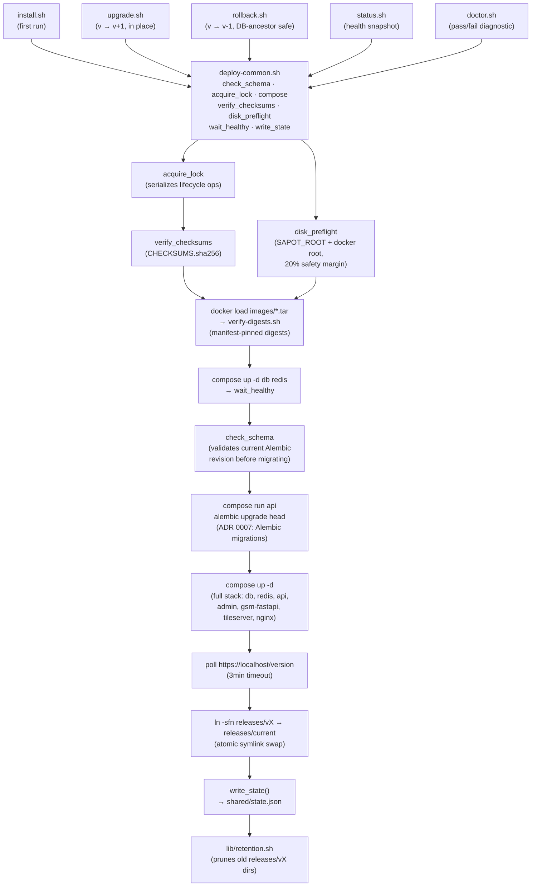
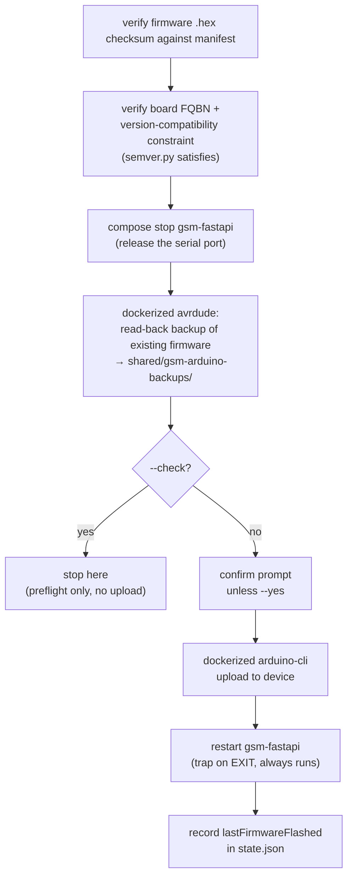

# Offline Docker Deployment Bundle

This is SAPOT's production Docker path for a LAN-only site. It is separate from
the developer compose stack and from the existing bare-metal/systemd deployment
path. Build one immutable bundle on a connected machine, transport it to the
site, then install it without pulling images or downloading dependencies.

## Architecture

### Build → ship → run

```mermaid
flowchart LR
    subgraph dev["Dev machine"]
        RS["scripts/release.sh<br/>tags version (semver)"]
        BB["scripts/build-bundle.sh<br/>builds images, manifest.json,<br/>CHECKSUMS.sha256, firmware .hex"]
    end

    subgraph bundle["Release artifact (deploy/ bundle dir)"]
        direction TB
        M["manifest.json"]
        C["CHECKSUMS.sha256"]
        I["images/*.tar"]
        CO["compose/*.yml"]
        E["config/*.env.example"]
        CE["certs/detect-ip.sh, gen-certs.sh"]
        F["firmware/gsm-arduino-*.hex"]
        D["data/static"]
        SC["scripts/ install · upgrade · rollback<br/>status · doctor · request-cert<br/>flash-gsm-firmware · lib/"]
    end

    subgraph target["Target (offline, LAN-only)"]
        INS["scripts/install.sh"]
    end

    RS -- "version tag read by" --> BB
    BB --> bundle
    bundle -- "removable media" --> INS
```



### On-target lifecycle

Every operator script (`install.sh`, `upgrade.sh`, `rollback.sh`, `status.sh`,
`doctor.sh`) is a thin wrapper around `scripts/lib/deploy-common.sh`,
which provides `check_schema`, `acquire_lock`, `compose`, `verify_checksums`,
`disk_preflight`, `wait_healthy`, and `write_state`.



### Filesystem layout on target (`$SAPOT_ROOT`, default `/opt/sapot`)

```
/opt/sapot/
├── releases/
│   ├── v1.2.0/              full copy of a bundle (cp -a from source)
│   ├── v1.3.0/
│   └── current -> v1.3.0    symlink, atomically repointed by install/upgrade/rollback
└── shared/                  persists across versions
    ├── state.json           (currentVersion, gsmHardwarePresent, history)
    ├── certs/                (TLS cert, CN = detected LAN IP)
    ├── db-data/
    ├── gsm-arduino-backups/  (pre-flash firmware backups)
    └── server.env, admin.env, gsm-fastapi.env, gsm-arduino.env
```

### GSM firmware flash (independent flow)



Safety mechanisms tying it together: `acquire_lock` serializes install/upgrade/
rollback/flash so only one lifecycle operation runs at a time; checksums and
manifest-pinned image digests mean the target never runs unverified images;
upgrade/rollback validate Alembic revisions ([ADR 0007](../adr/0007-alembic-for-server-migrations.md)) before migrating or reverting; and
`releases/current` is only repointed after the new stack passes a `/version`
health check, so a failed cutover leaves the previous release live.

## Build and transport

On a clean, tagged checkout with Docker, Compose v2, `python3`, `zstd`, and
`arduino-cli` installed, run:

```bash
./scripts/build-bundle.sh --min-upgrade-version 1.4.0 --max-rollback-version 1.4.0
```

The result is `dist/sapot-bundle-vX.Y.Z.tar.zst`. Its `manifest.json` records
the version, source commit, image IDs, firmware checksum, compatibility gates,
and disk requirement. `CHECKSUMS.sha256` detects accidental corruption during
transport. It is not a tamper-evident signature.

`--min-upgrade-version` sets the manifest's `minimumUpgradeVersion` gate:
`upgrade.sh` refuses to upgrade a target whose installed release is older than
this version, so operators aren't allowed to skip straight from an
unsupported ancient release into this one. `--max-rollback-version` sets
`maximumRollbackVersion`, described below under rollback.

Copy the tarball to the offline host by removable media, extract it, and run
the bundled scripts from the extracted release. The host needs Docker Engine,
Compose v2, `python3`, `openssl`, and sufficient local disk. It never needs
internet access during installation or upgrade.

## Install and operate

```bash
tar --use-compress-program=unzstd -xf sapot-bundle-vX.Y.Z.tar.zst
cd sapot-bundle-vX.Y.Z
sudo ./scripts/install.sh
sudo /opt/sapot/releases/current/scripts/status.sh
sudo /opt/sapot/releases/current/scripts/doctor.sh
```

`install.sh` verifies checksums, creates `/opt/sapot/shared` configuration and
certificates, loads images, runs Alembic forward migrations, waits for the API,
then atomically switches `/opt/sapot/releases/current`. Per-site environment
files, database data, certificates, firmware backups, and state remain in
`shared/`; release directories are immutable.

For a later artifact, extract it and run its `scripts/upgrade.sh`. Upgrades
are idempotent: if interrupted, even after the Alembic migration has already
completed, rerunning `upgrade.sh` is safe. Upgrades are not zero-downtime,
though — schedule a maintenance window and stop site traffic while one runs.

```bash
sudo ./scripts/upgrade.sh
```

To revert to a prior release instead:

```bash
sudo /opt/sapot/releases/current/scripts/rollback.sh 1.4.0
```

Rollback never runs `alembic downgrade`. It requires the target to be retained
locally, permitted by `maximumRollbackVersion`, and an ancestor of the live DB
revision. By default the current release and two prior releases, along with
their image IDs and recent firmware backups, are retained. Run
`scripts/lib/retention.sh --dry-run` to preview cleanup.

`doctor.sh` checks release checksums, image IDs, services, certificate, ports,
disk, and expected hardware. Add `--json` for structured output. A site with
no GSM modem normally shows `gsm-fastapi` as `unhealthy` in raw Docker output:
that is expected because its `/health` endpoint signals no modem. When the
installation's `state.json` records that no GSM hardware is attached,
`doctor.sh` and `status.sh` treat that `unhealthy` container as an expected,
non-blocking degraded state rather than a real failure.

## TLS certificates

`install.sh` generates a self-signed cert so the stack can come up. That cert
is not trusted by the mobile app, so a real deployment replaces it with a leaf
signed by the offline CA.

### What every leaf must contain

Every leaf issued for a SAPOT server carries three SANs:

```
DNS:server.sapot.lan, IP:<detected LAN IP>, DNS:localhost
```

`server.sapot.lan` is load-bearing and must never be dropped. Mobile
preview/production builds connect to that name (it is the build-time
`SERVER_NAME` constant) and their network-security config scopes the CA pin to
that domain alone, so a leaf without it fails TLS hostname verification on
every production handset no matter what the LAN IP is. See
[mobile-eas.md](mobile-eas.md#tls-ca-pinning). The IP SAN serves LAN clients
that reach the server by address, and `localhost` serves the in-container
health poll. `doctor.sh`'s `certificate` check fails if the DNS name is
missing, so a bad leaf is caught before it reaches the field.

The name is defined once as `SAPOT_SERVER_DNS_NAME` in
`deploy/scripts/lib/deploy-common.sh` and consumed by `install.sh`,
`request-cert.sh`, and `doctor.sh`. Override it there (or via the environment)
if a site uses a different hostname, and rebuild the mobile app to match.

### Issuing a leaf

The server host is deliberately never trusted with the CA private key. It only
ever handles a CSR and, later, a signed leaf. On the server:

```bash
sudo /opt/sapot/releases/current/scripts/request-cert.sh --force
```

`--force` is required in the normal case, because `install.sh` has already left
a key and self-signed cert on disk. It confirms reusing that key is intentional
and does not rotate it. Carry the resulting `server.csr` to the offline signing
laptop on a transport USB stick, sign it with `scripts/ca/sign-leaf.sh`, carry
`server.crt` back into `$SAPOT_ROOT/shared/certs`, and recreate `nginx` as
`request-cert.sh` instructs.

[runbooks.md](runbooks.md#tls-certificate-rotation-ca-pinned-server-leaf) has
the full step-by-step procedure, the digest cross-check that detects tampering
on the transport stick, the key-rotation warnings, and the recovery notes.

## Pitfalls

- **Bump the version for every rebuild**, even for a config/frontend-only fix.
  `upgrade.sh` targets `releases/v$version`; if that directory already exists
  it skips copying the new bundle in, so a same-version rebuild silently
  fails to deploy.
- **Never run bare `docker load` / `docker compose`** against a release.
  Always go through `install.sh` / `upgrade.sh`, which invoke compose with
  `-p sapot` via `deploy-common.sh`'s `compose()` wrapper. Omitting `-p sapot`
  creates a second, disconnected project instead of touching the live one. The
  one sanctioned exception is the `docker compose -p sapot ... up -d
  --force-recreate nginx` command `request-cert.sh` prints after a new leaf
  is dropped in — it still passes `-p sapot` and only recreates the single
  service that needs the new cert, rather than the whole stack.
- **Don't extract a bundle under `$HOME`** and run compose from there —
  `env_file` paths are relative to `$SAPOT_ROOT` and only resolve correctly
  once installed under `/opt/sapot/releases/...`.
- After any deploy, confirm `docker inspect <container> --format '{{.Image}}'`
  matches the digest in that release's `manifest.json` — a container showing
  "Up (healthy)" does not prove it's running the code you expect.

## GSM firmware

The bundle contains a precompiled Arduino hex file. Use:

```bash
sudo /opt/sapot/releases/current/scripts/flash-gsm-firmware.sh --check
sudo /opt/sapot/releases/current/scripts/flash-gsm-firmware.sh --yes
```

The script holds the same deployment lock as install and upgrade, verifies the
firmware checksum and board type, stops the GSM service, reads a backup before
uploading, and restarts the service on exit. `--check` includes the backup read
but never uploads.

## Troubleshooting

| Symptom | Cause | Fix |
|---|---|---|
| `already installed (vX) - use upgrade.sh instead` | `install.sh` run on a host that already has `releases/current` | Run `upgrade.sh` from the new bundle instead |
| `bundle checksum verification failed` | Corrupted transfer, or the bundle was modified after build | Re-copy the tarball from source media and re-extract; do not bypass the check |
| `insufficient free space on <path>` | `requiredDiskBytes` plus the 20% margin exceeds free space on `$SAPOT_ROOT` or the Docker root | Free space or prune old releases with `scripts/lib/retention.sh` |
| `nginx/api did not become ready` | Stack came up but `/version` never answered within 3 minutes | `docker compose -p sapot logs api nginx`; the previous release is still live, so the cutover has not happened |
| Upgrade appears to succeed but nothing changed | The bundle reuses a version already in `releases/` | Rebuild with a bumped version (see Pitfalls) |
| `doctor.sh` reports `certificate SAN does not cover server.sapot.lan` | Leaf issued without the required DNS SAN | Reissue via the offline-CA workflow; mobile production builds cannot connect until fixed |
| `server.key exists but no server.csr or server.crt` | A previous `request-cert.sh` run was interrupted | If no leaf was ever issued from that key, `--force --rotate-key` is safe |
| `refusing to sign: <dir> appears to be on the root filesystem` | CA USB stick not mounted, or a stale mountpoint left by an unplugged drive | Mount the CA stick and retry; do not set `SAPOT_CA_ALLOW_LOCAL=1` for production signing |
| `refusing to sign: CSR has no Subject Alternative Name` | CSR generated outside `request-cert.sh` | Regenerate the CSR with `request-cert.sh` |
| `gsm-fastapi` shows `unhealthy` in `docker ps` | No modem attached | Expected. `doctor.sh` and `status.sh` treat this as non-blocking when `state.json` records no GSM hardware |

## Limitations

- **Database backup and restore are out of scope.** Take backups separately, per
  [runbooks.md](runbooks.md#backup-and-restore-mariadb). Rollback protects the
  application, not the data.
- **No automatic certificate renewal.** Leaves are valid ~825 days and must be
  reissued by hand through the offline-CA workflow before expiry, or whenever
  the site's LAN IP changes.
- **Upgrades are not zero-downtime.** Schedule a maintenance window.
- **`CHECKSUMS.sha256` detects corruption, not tampering.** It is not a signature.
  Bundle integrity depends on controlling the physical transport media.
- **Rollback never reverses a migration.** A release whose schema changes are not
  an ancestor of the live DB revision cannot be rolled back to.
- **Single-host only.** The bundle assumes one Docker host per site.
