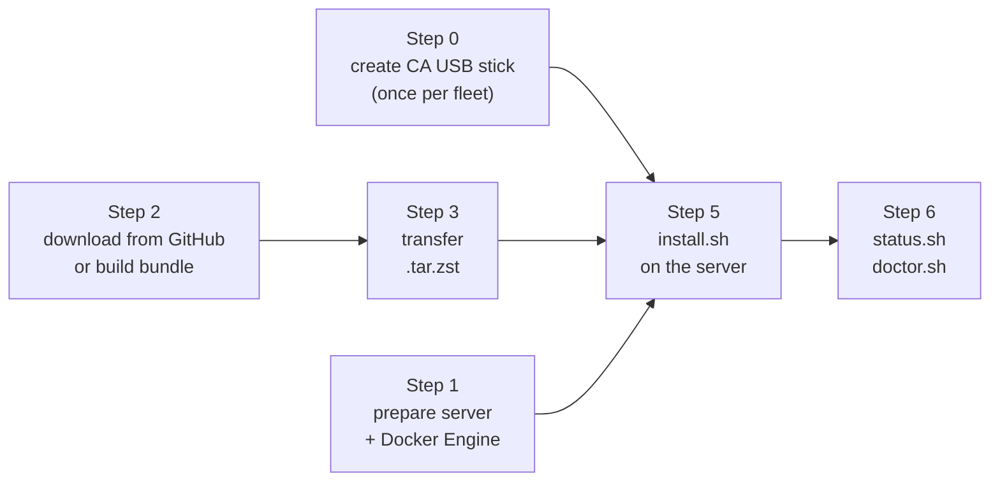

# Installing SAPOT on Ubuntu Server 24.04 (Docker bundle)

Step-by-step walkthrough for standing up a new SAPOT site on a fresh Ubuntu
Server 24.04 LTS host, using the offline Docker bundle.

Follow this the first time you deploy a server. For the design behind the
bundle, the upgrade/rollback lifecycle, and the full script reference, see
[docker-bundle.md](docker-bundle.md). For a second or later release on a host
that is already running, you want `upgrade.sh`, not this guide.

## What this gets you

One Docker host running the whole server side of SAPOT: API, admin dashboard,
MariaDB, Redis, offline map tileserver, SMS gateway, and the TLS terminator in
front of them. No internet access is needed at the site once Docker Engine is
installed.

## What you need before you start

Three things, and they are not interchangeable:

| Thing | What it is | Why |
|---|---|---|
| **Build host** | A connected machine. Usually, you only need this to download the pre-built bundle from GitHub Releases. A manual build also needs a clean checkout, Docker's containerd image store, Compose v2, `python3`, `zstd`, and `arduino-cli` | Downloads or builds the bundle. It is the only machine that needs internet. |
| **Target server** | The site's Ubuntu Server 24.04 LTS machine, on the LAN | Runs SAPOT. Needs internet once, to install Docker Engine. |
| **CA USB stick** | A removable drive holding `server_ca.key` and `server_ca.pem` | Signs the server's TLS certificate. Without it, installation aborts. |

The build host and the target server can be the same physical machine only if
that machine can be taken online to build. In practice they are separate.



---

## Step 0: Create the CA USB stick

Do this once for the whole deployment, not once per server. Every SAPOT server
gets its TLS certificate signed by this one certificate authority (CA), and the
mobile app pins that CA at build time.

**Skip this step if a CA stick already exists.** Creating a second CA means
every handset in the field stops trusting the servers signed by the first one,
and the mobile app has to be rebuilt and redistributed
([mobile-eas.md](mobile-eas.md#tls-ca-pinning)).

On an offline machine, not on the server:

```bash
openssl req -x509 -newkey rsa:4096 -nodes -days 3650 \
  -keyout server_ca.key -out server_ca.pem \
  -subj "/CN=SAPOT LAN Root CA"
```

- `-nodes` leaves the key without a passphrase. That is acceptable only because
  the key never leaves a physically controlled stick.
- `-days 3650` gives the CA ten years. Leaf certificates are much shorter-lived
  and are reissued from this CA.

Verify what you produced before trusting it:

```bash
openssl x509 -in server_ca.pem -noout -subject -dates
# subject=CN = SAPOT LAN Root CA
# notBefore / notAfter should span 10 years
```

Then:

1. Copy both files onto a USB stick reserved for this purpose, and format it
   with a **writable** filesystem (ext4 or exFAT). Issuance appends to
   `server_ca.srl` and `issued-leaves.log` on the stick, so a read-only mount
   fails.
2. Wipe both files from the machine that generated them.
3. Copy `server_ca.pem` (the public half only) to the mobile app build, as
   described in [mobile-eas.md](mobile-eas.md#tls-ca-pinning).
4. Store the stick somewhere physically secure and record who may draw it out.

The stick ends up holding:

| File | Created by | Sensitivity |
|---|---|---|
| `server_ca.key` | you, in Step 0 | Private. Compromise means every SAPOT server can be impersonated. |
| `server_ca.pem` | you, in Step 0 | Public. Also shipped inside the mobile app. |
| `server_ca.srl` | issuance | Serial counter. Keep it. |
| `issued-leaves.log` | issuance | One line per certificate issued. The only record tying a deployed certificate to the run that made it. |

Full background and the recovery cases are in
[runbooks.md](runbooks.md#offline-ca-setup).

---

## Step 1: Prepare the target server

Install **Ubuntu Server 24.04 LTS**. A minimal install is fine, and no desktop
environment is needed.

Before installing SAPOT:

- **Give the server a fixed LAN address.** Use a static IP or a DHCP
  reservation on the MikroTik router. The certificate issued in Step 5 carries
  this IP, so changing it later means reissuing the certificate.
- **Leave ports 80 and 443 free.** The bundle binds both. If Ubuntu's
  `apache2` or `nginx` package is present, remove or disable it.
- **Check the clock.** `timedatectl` should show the clock synchronized. A
  server with a badly wrong clock issues a certificate that clients reject as
  not-yet-valid.
- **Check free disk.** The installer reserves space for the copied release,
  compressed Docker content, and the unpacked image sizes recorded during the
  build, then adds a 20% margin. When those paths share a filesystem, it adds
  their needs before checking free space. Containerd-backed Docker is checked
  at `/var/lib/containerd`, where its snapshots are actually stored.

### Install Docker Engine from Docker's own apt repository

Use Docker's repository, not Ubuntu's `docker.io` package. `docker.io` lags
upstream and does not ship the Compose v2 plugin, and every bundle script runs
`docker compose` through that plugin. An install with `docker.io` fails at the
first compose call.

This is the one step that needs internet on the server. Do it before the
machine goes to a site with no connectivity.

```bash
sudo apt-get update
sudo apt-get install -y ca-certificates curl zstd

sudo install -m 0755 -d /etc/apt/keyrings
sudo curl -fsSL https://download.docker.com/linux/ubuntu/gpg \
  -o /etc/apt/keyrings/docker.asc
sudo chmod a+r /etc/apt/keyrings/docker.asc

echo "deb [arch=$(dpkg --print-architecture) signed-by=/etc/apt/keyrings/docker.asc] \
https://download.docker.com/linux/ubuntu $(. /etc/os-release && echo "$VERSION_CODENAME") stable" \
  | sudo tee /etc/apt/sources.list.d/docker.list > /dev/null

sudo apt-get update
sudo apt-get install -y docker-ce docker-ce-cli containerd.io \
  docker-buildx-plugin docker-compose-plugin
```

`zstd` is in that first `apt-get install` because the bundle ships as a
`.tar.zst` archive and Ubuntu Server does not always include the CLI tool.

Confirm all three before continuing:

```bash
docker --version              # Docker version 27.x or newer
docker compose version        # Docker Compose version v2.x  (note: no hyphen)
sudo docker run --rm hello-world
```

If `docker compose version` reports "is not a docker command", the Compose
plugin is missing and you are most likely on `docker.io`. Remove it
(`sudo apt-get remove docker.io docker-compose`) and redo this section.

`python3`, `openssl`, `curl`, and `ss` are used by the bundle scripts and are
already present on a standard Ubuntu Server 24.04 install.

---

## Step 2: Download or build the bundle

The standard way to get a bundle is through the GitHub Releases page. The
release workflow builds it automatically when a `bundle/vX.Y.Z` tag is pushed.

On your connected machine, find the required bundle release and download both:

- `sapot-bundle-vX.Y.Z.tar.zst`
- `sapot-bundle-vX.Y.Z.tar.zst.sha256`

### Alternative: Build the bundle manually

If you cannot use the pre-built GitHub release, build it from a **clean**
checkout of the tagged commit:

```bash
./tileserver/download-script.sh
./scripts/build-bundle.sh
```

The manual build requires Docker's containerd image store so its layer archives
match the compressed GitHub bundle format. See
[Offline Docker Deployment Bundle](docker-bundle.md#build-and-transport) for the
check and setup instructions.

The build refuses to start if tracked files are modified, so that the recorded
git SHA describes exactly what is inside the bundle.

Compatibility bounds come from the reviewed `deploy/bundle-release-policy.json`
file. `minimumUpgradeVersion` is the oldest installed bundle accepted by
`upgrade.sh`; `minimumRollbackVersion` is the oldest retained bundle accepted by
`rollback.sh`.

The bundle version comes from `deploy/VERSION` and is independent of the server,
admin, and GSM component versions recorded in the generated manifest.

**Bump the version for every rebuild**, even a config-only or frontend-only
change. `upgrade.sh` targets `releases/v$version` and skips copying if that
directory already exists, so a same-version rebuild appears to deploy and
changes nothing. See the repo-root `VERSIONING.md`.

The build takes several minutes: it builds four images, pulls four more,
compiles the Arduino firmware, and compresses everything. The result is:

```
dist/sapot-bundle-vX.Y.Z.tar.zst
```

Create the checksum file that travels with the archive:

```bash
(cd dist && sha256sum sapot-bundle-vX.Y.Z.tar.zst > sapot-bundle-vX.Y.Z.tar.zst.sha256)
```

GitHub Releases already provides this `.sha256` file.

---

## Step 3: Transfer the bundle to the server

From the directory containing both files, transfer them over the LAN:

```bash
scp sapot-bundle-vX.Y.Z.tar.zst sapot-bundle-vX.Y.Z.tar.zst.sha256 <server-name>@<server-ip>:/var/tmp/
```

Or by removable media, for a genuinely disconnected site. Use a different stick
from the CA stick.

On the server, verify the archive against the downloaded checksum file:

```bash
cd /var/tmp
sha256sum -c sapot-bundle-vX.Y.Z.tar.zst.sha256
```

If it differs, re-copy. Do not install a bundle that failed this check.

---

## Step 4: Extract the bundle

```bash
cd /var/tmp
tar --use-compress-program=unzstd -xf sapot-bundle-vX.Y.Z.tar.zst
cd sapot-bundle-vX.Y.Z
```

This extracted directory is only the *source* for the installer. `install.sh`
copies it into `/opt/sapot/releases/vX.Y.Z` and runs everything from there, so
`/var/tmp` is a fine place to leave it. Never run `docker compose` by hand from
the extracted copy: the compose file's paths resolve relative to `/opt/sapot`,
and a manual `docker compose` without `-p sapot` creates a second, disconnected
stack alongside the real one.

---

## Step 5: Run the installer

Plug the CA USB stick into the server first, and confirm it is mounted
read-write:

```bash
lsblk -f
```

Then, from inside the extracted bundle directory:

```bash
sudo ./scripts/install.sh
```

The installer, in order:

1. Verifies the release against `CHECKSUMS.sha256`.
2. Finds and validates the CA stick, printing the CA's subject and validity so
   you can confirm which CA is about to sign. **It aborts here if the stick is
   missing, read-only, mounted stale, or carries mismatched CA material.**
   There is no self-signed fallback.
3. Checks the combined release, Docker content, and unpacked-layer disk
   requirement on every filesystem involved.
4. Copies the release to `/opt/sapot/releases/vX.Y.Z` and generates
   `/opt/sapot/shared/*.env` with fresh random secrets. You do not need to edit
   these by hand for a standard site.
5. Detects the LAN IP and issues the TLS certificate from the CA stick.
6. Loads the container images and verifies each image identity against both the
   bundle archive and the digest pinned in `manifest.json`.
7. Starts MariaDB and Redis, waits for both to be healthy, then runs
   `alembic upgrade head` to build the schema.
8. Starts the full stack and polls `https://localhost/version` for up to three
   minutes.
9. Points `/opt/sapot/releases/current` at the new release, installs the
   systemd units, and enables the daily database backup timer.
10. Prompts you to create the first administrator.

Three prompts need an answer:

| Prompt | Answer |
|---|---|
| `LAN IP for TLS certificate:` | Only appears if automatic detection failed. Enter the server's LAN IP, for example `192.168.0.100`. |
| `Is the GSM Arduino connected at /dev/ttyACM0?` | `y` only if the SMS gateway hardware is physically attached. Answering `n` is normal and simply marks the site as having no modem. |
| Administrator username, name, phone, email, password | Creates the first admin account. The password is one-shot: the operator must change it and accept the Terms & Conditions at first login. |

When the installer prints `certificate issued - the CA USB stick can be
unplugged now`, unplug it. It is not needed for the rest of the run.

**If the run fails partway through**, the previous state is intact and you can
fix the cause and rerun `install.sh`, as long as it never reached step 9. Once
`releases/current` exists, `install.sh` refuses to run again and directs you to
`upgrade.sh`.

**If only the administrator prompt fails or is cancelled**, the installation
itself succeeded. Finish it with:

```bash
sudo /opt/sapot/releases/current/scripts/bootstrap-admin.sh
```

---

## Step 6: Check the install

Two commands. `status.sh` is a snapshot, `doctor.sh` is a pass/fail diagnostic
that exits non-zero if anything is wrong.

```bash
sudo /opt/sapot/releases/current/scripts/status.sh
sudo /opt/sapot/releases/current/scripts/doctor.sh
```

`status.sh` prints the version, git SHA, build time, free disk, and one line per
service. All seven should read `healthy`, except `nginx` (`up`) and, on a site
with no modem, `gsm-fastapi` (`up (no modem attached)`).

`doctor.sh` checks release checksums, image identities, disk, every service, the
certificate chain and SANs, ports 80 and 443, the GSM device if one is
expected, backup age, and the administrator account. Add `--json` for
machine-readable output.

Three results are expected on a fresh install and are not faults:

| Result | Why | What to do |
|---|---|---|
| `db-backup: FAIL - no backups in /opt/sapot/shared/db-backups` | The backup timer fires daily and has not run yet | Take one now: `sudo systemctl start sapot-db-backup.service`, then rerun `doctor.sh` |
| `gsm-fastapi: PASS - no modem attached, degraded health expected` | The service reports unhealthy without a modem, and the installer recorded that this site has none | Nothing |
| `administrator: PASS - initial password not yet changed` | The one-shot password is still in place | Clears itself at first dashboard login (Step 8) |

Anything else that fails is a real problem. See the troubleshooting table below
and the fuller one in [docker-bundle.md](docker-bundle.md#troubleshooting).

---

## Step 7: Make the server resolvable as `server.sapot.lan`

Mobile preview and production builds connect to the hostname
`server.sapot.lan`, and their CA pin is scoped to that name alone. The
certificate issued in Step 5 already carries it as a SAN, but the name still has
to resolve on the LAN, and nothing in the bundle can do that for you.

On the MikroTik router, add a static DNS entry pointing at the server's LAN IP:

```
/ip dns static add name=server.sapot.lan address=192.168.0.100
```

Handsets must be using the router as their DNS server for this to take effect.

To verify from a laptop on the same LAN, using the public CA certificate from
the stick:

```bash
curl --cacert server_ca.pem https://server.sapot.lan/version
```

A JSON version response means TLS, the certificate chain, the hostname, and the
API are all correct end to end. For a quick check without touching router
config, add the same mapping to the laptop's `/etc/hosts` instead.

---

## Step 8: First administrator login

Open the dashboard at `https://<server-lan-ip>/admin` (or
`https://server.sapot.lan/admin` once Step 7 is done) and sign in with the
account created during install.

The first login forces a password change and acceptance of the Terms &
Conditions. After that, `doctor.sh` reports `administrator: admin account
configured`.

If you ever lose access, `reset-admin-password.sh` is the break-glass path. It
confirms which administrator you mean, then sets a new one-shot password.

---

## What to do next

| Task | Where |
|---|---|
| Deploy a later release to this host | [docker-bundle.md](docker-bundle.md#install-and-operate) (`upgrade.sh`) |
| Flash the GSM Arduino firmware | [docker-bundle.md](docker-bundle.md#gsm-firmware) |
| Configure off-host backup copies | [runbooks.md](runbooks.md#backup-and-restore-mariadb) |
| Reissue the TLS certificate (expiry or IP change) | [runbooks.md](runbooks.md#tls-certificate-rotation-ca-pinned-server-leaf) |
| Recurring maintenance schedule | [maintenance.md](maintenance.md) |
| Build and distribute the mobile app against this CA | [mobile-eas.md](mobile-eas.md) |

---

## Troubleshooting

Failures specific to a first install. The wider table lives in
[docker-bundle.md](docker-bundle.md#troubleshooting).

| Symptom | Cause | Fix |
|---|---|---|
| `docker compose version` says "is not a docker command" | The Compose v2 plugin is missing, usually because `docker.io` was installed instead of `docker-ce` | Redo the Docker section of Step 1 |
| `tar: unrecognized option '--use-compress-program'` or `unzstd: not found` | `zstd` is not installed | `sudo apt-get install zstd` while the server is still online |
| `no CA USB stick found` | The stick is not plugged in, not mounted, or mounted outside the searched paths | Plug it in, check `lsblk -f`, or pass `--ca-dir <mount>` |
| `refusing to sign: <dir> is on the root filesystem` | The stick was never mounted, or a stale mountpoint was left behind by an unplugged drive | Mount the stick properly. Do not set `SAPOT_CA_ALLOW_LOCAL=1` on a production server |
| `CA USB stick at <dir> is not writable` | Mounted read-only, so the serial file and issuance log cannot be updated | `sudo mount -o remount,rw <mount>` |
| `bundle checksum verification failed` | The transfer corrupted the archive | Re-copy from Step 3 and re-extract. Do not bypass the check |
| `insufficient free space on <filesystem>` | The copied release, Docker content, estimated unpacked layers, and 20% margin exceed the available space | Free space, or move Docker and containerd storage to a larger disk |
| `Docker image store ran out of space while unpacking` | Docker accepted the archive but containerd could not extract a layer | Free space under `/var/lib/containerd`, then rerun `install.sh` |
| `nginx/api did not become ready` | The stack started but `/version` never answered within three minutes | `sudo docker compose -p sapot -f /opt/sapot/releases/vX.Y.Z/compose/docker-compose.yml logs api nginx` |
| Ports 80/443 fail to bind | Another web server is installed on the host | `sudo ss -ltnp 'sport = :443'`, then stop and disable whatever holds them |
| `doctor.sh` reports `certificate SAN does not cover server.sapot.lan` | The certificate was issued outside the bundle workflow | Reissue with `request-cert.sh`. Production handsets cannot connect until this is fixed |

## Limitations

- **The server needs internet once.** Docker Engine comes from Docker's apt
  repository. Everything after that is offline, but the machine cannot go to a
  disconnected site before Step 1 is done.
- **Single host per site.** The bundle assumes one Docker host.
- **Installation is not unattended.** It prompts for GSM hardware and for the
  first administrator's details.
- **`CHECKSUMS.sha256` detects corruption, not tampering.** It is not a
  signature. Bundle integrity rests on controlling the transport media.
