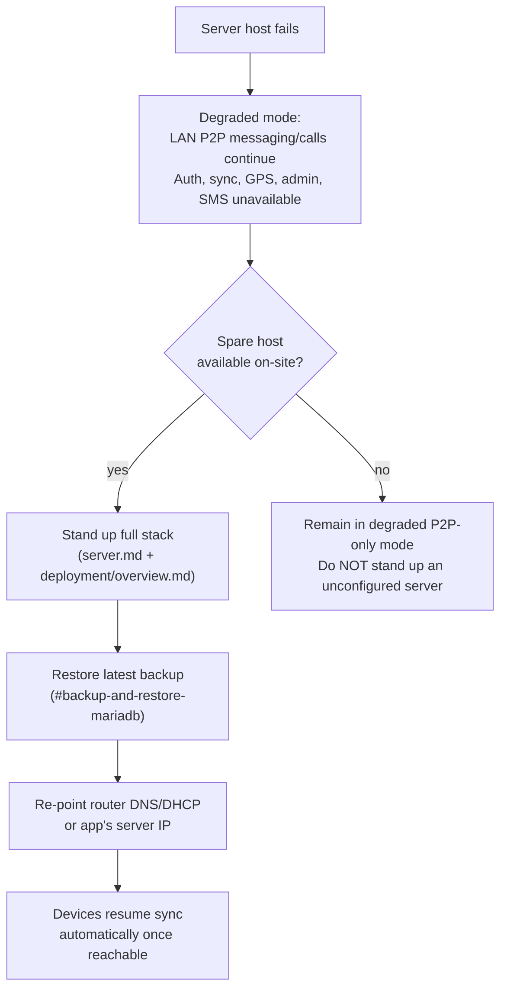

# Operational Runbooks

Step-by-step procedures for operating SAPOT in production. Each runbook includes a verification step — do not consider a procedure complete until verification passes.

---

## Backup and restore (MariaDB)

**When:** Before any schema change (see [ADR 0002](../adr/0002-no-server-migration-tooling.md)), on a regular schedule if the deployment is long-running, and always before a disaster-recovery restore.

### Backup

```bash
mysqldump --single-transaction -u sapot -p sapot_db > sapot_db_$(date +%Y%m%d_%H%M%S).sql
```

- `--single-transaction` avoids locking tables on InnoDB, so the server can keep running during backup.
- Store the dump off the server host if possible (a USB drive at the incident site, or the admin's laptop) — a backup that lives only on the machine it protects against doesn't survive hardware failure.

### Restore

```bash
sudo systemctl stop server-main-api
mysql -u sapot -p sapot_db < sapot_db_20260701_120000.sql
sudo systemctl start server-main-api
```

**Verification:**
```bash
mysql -u sapot -p -e "SELECT COUNT(*) FROM sapot_db.peer;"
curl -k https://localhost/auth/exists?email=probe@example.com   # expect 200 or 404, not 500
sudo journalctl -u server-main-api -n 50 --no-pager   # confirm no startup errors
```

---

## Manual DB DDL application (no Alembic)

**When:** A SQLModel class in `server/app/models/` changed (new column, renamed column, changed type). See [migrations.md](../database/migrations.md) and [ADR 0002](../adr/0002-no-server-migration-tooling.md) for why this is manual.

1. **Back up first** — run the [backup procedure](#backup-and-restore-mariadb) above. This is the only rollback path; there is no `alembic downgrade`.
2. Diff the model change against the current table structure:
   ```bash
   mysql -u sapot -p -e "DESCRIBE sapot_db.<table_name>;"
   ```
3. Write the equivalent `ALTER TABLE` by hand. Examples:
   ```sql
   ALTER TABLE peer ADD COLUMN last_seen_at DATETIME NULL;
   ALTER TABLE announcement MODIFY COLUMN priority ENUM('low','normal','high') NOT NULL;
   ```
4. Apply it to production **before** deploying the new server code — the running code and the schema must never diverge, since `create_db_and_tables()` only creates missing tables, it never alters existing ones.
   ```bash
   mysql -u sapot -p sapot_db < alter_peer_add_last_seen_at.sql
   ```
5. Deploy the updated server code and restart:
   ```bash
   sudo systemctl restart server-main-api
   ```
6. **Record what you did.** There is no `alembic_version` table tracking this — append the applied SQL file name and date to a changelog (e.g. a dated comment in [migrations.md](../database/migrations.md) or a local ops log) so the next person doesn't have to reverse-engineer the DB's actual state from the code.

**Verification:**
```bash
mysql -u sapot -p -e "DESCRIBE sapot_db.<table_name>;"   # confirm the new column/type is present
sudo journalctl -u server-main-api -n 50 --no-pager       # confirm no startup errors after restart
```

**Rollback if it goes wrong:** stop the service, restore from the pre-change backup ([restore procedure](#backup-and-restore-mariadb)), redeploy the previous server code version, restart.

---

## TLS certificate rotation

**When:** Before the self-signed certificate at `/home/sapot/certs/server.crt` expires, or immediately if the private key may have been exposed.

1. Generate a new self-signed cert (or one from your CA of choice):
   ```bash
   openssl req -x509 -newkey rsa:4096 -keyout server.key -out server.crt -days 365 -nodes \
     -subj "/CN=<sapot-server-host-or-ip>"
   ```
2. Copy to the server host and restrict permissions:
   ```bash
   sudo cp server.crt server.key /home/sapot/certs/
   sudo chmod 600 /home/sapot/certs/server.key
   sudo chown sapot:sapot /home/sapot/certs/server.*
   ```
3. Reload Nginx (no downtime — Nginx re-reads certs on reload, not just restart):
   ```bash
   sudo nginx -t && sudo systemctl reload nginx
   ```
4. **Rebuild and redistribute the mobile app.** The mobile app pins this certificate at build time (see [secrets-management.md](secrets-management.md#tls-certificate) and [mobile-eas.md](mobile-eas.md)) — old app builds will fail to connect against a rotated cert until updated. This is the step most likely to be forgotten; plan the rebuild before rotating, not after.

**Verification:**
```bash
echo | openssl s_client -connect <sapot-server-host>:443 2>/dev/null | openssl x509 -noout -dates
# confirm notAfter reflects the new cert's expiry
```
Then confirm a rebuilt mobile app can connect (login screen loads without a TLS error) before retiring old app builds from use.

---

## Rollback (server code deploy)

**When:** A server deploy introduces a regression and needs to be reverted.

1. Identify the last known-good git tag/commit (see [VERSIONING.md](../../VERSIONING.md)).
2. If the deploy included a DDL change, **do not roll back code without also reverting the schema** — check whether the new columns/tables the deploy added are still compatible with the old code (additive changes usually are; renames/type changes are not). If incompatible, restore the pre-deploy DB backup first.
3. Redeploy the previous code version:
   ```bash
   cd server
   git checkout <previous-tag>
   source app/venv/bin/activate && pip install -r app/requirements.txt
   sudo systemctl restart server-main-api
   ```
4. Confirm the regression is gone and file the incident for follow-up.

**Verification:** same health-check as the [backup/restore procedure](#backup-and-restore-mariadb), plus manual confirmation the specific regression is resolved.

---

## Disaster recovery — server hardware fails at incident site

**When:** The laptop/server hardware running the FastAPI server, MariaDB, and Redis fails or is destroyed mid-deployment.

**Immediate impact:** Mobile-to-mobile LAN messaging and calls **continue to work** — they are P2P and do not depend on the server (see [system-overview.md](../architecture/system-overview.md#system-boundaries)). What breaks immediately: new logins/registration, cross-device sync, GPS streaming to rescuers, announcements, admin operations, and SMS fallback (GSM module depends on the same DB).



**Recovery steps:**

1. **If a spare host is available on-site:** stand up the full stack fresh (see [server.md](server.md), [deployment/overview.md](overview.md#deployment-order)) and restore the most recent [backup](#backup-and-restore-mariadb). If backups were only stored on the failed host, this step is impossible — see the note on off-host backup storage above.
2. **If no spare host is available:** the LAN continues to function in degraded P2P-only mode. Do not attempt to route around this with a temporary unsecured server — bringing up a server without `DATABASE_URL`/`JWT_SECRET_KEY`/`CORS_ALLOWED_ORIGINS` properly configured re-opens the issues fixed in [SECURITY.md](../../SECURITY.md).
3. Once a replacement host is running, re-point the MikroTik router's DNS/DHCP (or the mobile app's configured server IP, if static) at the new host's address.
4. Mobile devices with cached credentials will resume syncing automatically once the server is reachable at the expected address; devices requiring fresh login need the new server reachable first.

> **TODO (human input required):** Confirm whether a pre-staged spare host/image is part of the standard field kit, and document the expected recovery time objective (RTO) for an incident deployment.

See [operating-constraints.md](operating-constraints.md) for the broader set of power/connectivity/degraded-mode assumptions this recovery procedure operates under.
