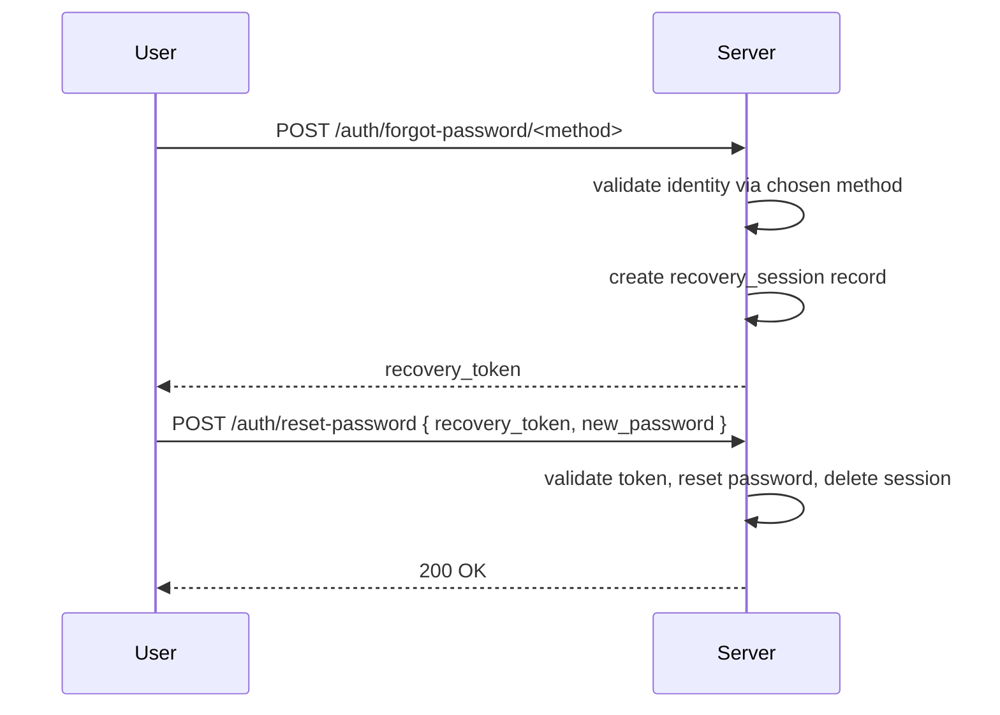
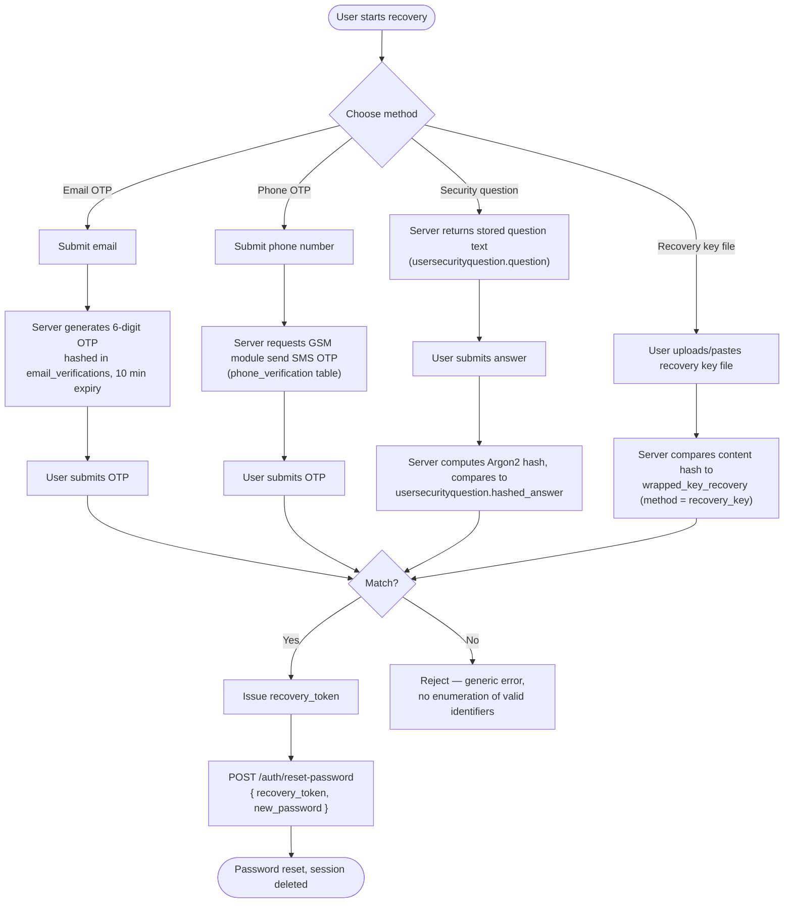
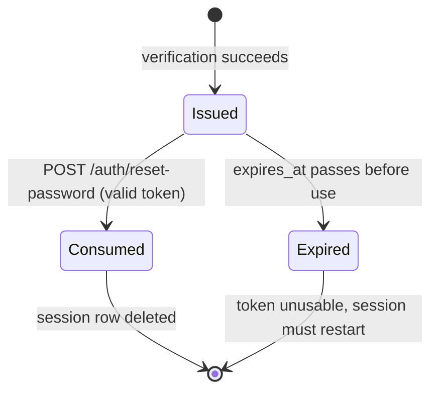

# Account Recovery — Design

## Architecture

Account recovery is implemented across:
- `server/app/api/forgot_password.py` — all `/auth/forgot-password/*` endpoints (email/phone OTP, security question, recovery key, email magic link, reset-password)
- `server/app/api/user_keys.py` — recovery-copy key setup and retrieval (`/users/recovery-setup`, `/users/recovery-key`, `/users/recovery-keys`)
- `server/app/db_operations/wrapped_key_recovery.py` — recovery-session and wrapped-key recovery logic behind those routes
- `server/app/models/` — `usersecurityquestion`, `recovery_session`, `recovery_attempt`, `wrapped_key_recovery`, OTP tables

This feature is server-mediated; it has no P2P path.

---

## Recovery flow overview

```
User → POST /auth/forgot-password/<method>
     → Server validates identity via chosen method
     → Server creates recovery_session record, returns recovery_token
     → User → POST /auth/reset-password { recovery_token, new_password }
     → Server validates token, resets password, deletes session
```



---

## Verification methods

All four methods are independent ways to prove identity, but converge on the same outcome — an issued `recovery_token` — and the same final step (`POST /auth/reset-password`):



### Email OTP

1. User submits their email address.
2. Server generates a 6-digit OTP, stores it hashed in `email_verifications` with a 10-minute `expires_at`.
3. Server sends the OTP to the user's email.
4. User submits the OTP; server validates and issues a `recovery_token`.

### Phone OTP

1. User submits their phone number.
2. Server requests the GSM module to send a 6-digit SMS OTP (`phone_verification` table).
3. User submits the OTP; server validates and issues a `recovery_token`.
4. Requires `server-GSM-api.service` to be running; fails gracefully if unavailable.

### Security question

1. Server returns the user's stored question text from `usersecurityquestion.question`.
2. User submits their answer.
3. Server computes Argon2 hash of the submitted answer and compares to `usersecurityquestion.hashed_answer`.
4. On match, issues a `recovery_token`.

### Recovery key file

1. User uploads or pastes their recovery key file content.
2. Server validates the content against the hash stored in `wrapped_key_recovery` (where `method = "recovery_key"`).
3. On match, issues a `recovery_token`.

---

## Recovery session

| Column | Type | Notes |
|---|---|---|
| `id` | UUID | PK |
| `user_id` | UUID | FK → user.id |
| `token_hash` | VARCHAR | Hashed recovery_token — plaintext never stored |
| `expires_at` | DATETIME | Session expiry |
| `method` | VARCHAR | `email_otp`, `phone_otp`, `security_question`, or `recovery_key` |

The plaintext `recovery_token` is returned to the client once and never stored. After a successful password reset, the session row is deleted (token consumed).



---

## Password reset

`POST /auth/reset-password`:
1. Accepts `{ recovery_token, new_password }`.
2. Looks up `recovery_session` by hashing the submitted token.
3. Checks `expires_at` — rejects if expired (401).
4. Hashes `new_password` with Argon2, writes to `user.hashed_password`.
5. Deletes the `recovery_session` row.

---

## Recovery key setup

`POST /users/recovery-setup` — stores a hashed copy in `wrapped_key_recovery` with `method = "recovery_key"`. Also stores wrapped copies of the user's E2E master key for each recovery method (see [e2e-encryption design](../e2e-encryption/design.md)).

`GET /users/recovery-key` — returns the raw key material for the user to download and store offline.

---

## Security considerations

- Recovery tokens are single-use and short-lived — consuming one deletes the session immediately.
- Security question answers are Argon2-hashed, making offline dictionary attacks expensive.
- Phone OTP delivery depends on the GSM module; the method should be disabled gracefully if the module is unreachable.
- All recovery endpoints must be rate-limited to prevent OTP brute-forcing and enumeration.

---

## Non-goals

- No account recovery without at least one pre-configured method (security question, recovery key file, or verified email/phone) — there is no "contact support" fallback for a user who set up none of these.
- No cross-method recovery upgrade flow (e.g. automatically registering a new recovery method after successfully recovering via another) — each method is independent.
- Not a replacement for [E2E key recovery](../e2e-encryption/design.md#key-recovery-wrapping) UX — this feature covers *password* reset; the wrapped-key re-wrap step is a separate, coupled step documented there.

## Failure handling

- **Expired recovery session:** `POST /auth/reset-password` returns 401 if `expires_at` has passed; the user must restart the recovery flow from the beginning (no session extension).
- **GSM module unreachable:** phone OTP requests fail gracefully — the method is unavailable, but other configured recovery methods (email OTP, security question, recovery key file) remain usable, per the security-considerations note above.
- **Wrong OTP/security answer:** rejected without revealing whether the identifier (email/phone) exists, consistent with the [phantom budget](../authentication/design.md#login-lockout) anti-enumeration approach used elsewhere.
- **Recovery key file corrupted or wrong:** hash comparison fails; the user must fall back to a different configured recovery method — there is no partial-match recovery.

## Performance impact

- Argon2 hashing of security-question answers has the same CPU cost profile as password hashing (see [authentication design](../authentication/design.md#performance-impact)) — deliberate, not a bug.
- OTP generation and delivery latency for phone OTP is bounded by the GSM module's serial round-trip (see [sms-gateway design](../sms-gateway/design.md)), which is slower than email OTP delivery.

## Scalability

- Recovery volume is expected to be low relative to login volume (an incident-response deployment is short-lived, and forgotten passwords are a minority case) — no dedicated scaling considerations beyond the standard rate limits below.
- `recovery_session` rows are short-lived and self-cleaning (deleted on success or left to expire) — no unbounded table growth expected, unlike `blacklistedtoken` (see [authentication design](../authentication/design.md#scalability)).

## Acceptance criteria

- A user with a configured recovery method can reset their password without contacting an administrator.
- A consumed or expired recovery token cannot be reused.
- Security question answers are never stored or compared in plaintext.
- Recovery endpoints are rate-limited to prevent OTP brute-forcing.
- Losing the GSM module does not lock out users who configured a different recovery method.
