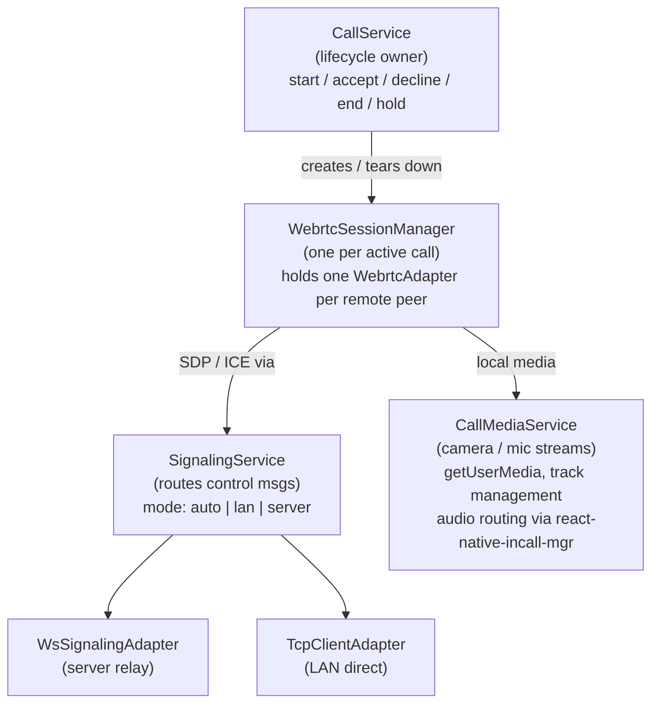
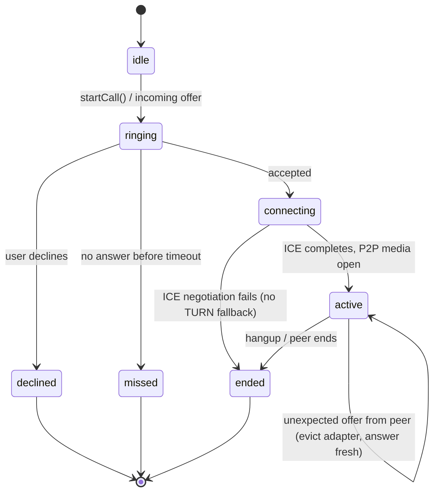

# Calls — Design

## Overview

Voice and video calls are established peer-to-peer over WebRTC. Server signalling relays SDP offers, answers, and ICE candidates until the direct LAN media path is open. Once the P2P connection is live the server carries no media; it carries only control messages.

---

## Architecture

```
┌──────────────────────────────────────────────┐
│                  CallService                 │  ← lifecycle owner
│  start / accept / decline / end / hold       │
└───────┬──────────────────────────────────────┘
        │ creates / tears down
        ▼
┌──────────────────────────────────────────────┐
│           WebrtcSessionManager               │  ← one per active call
│  holds one WebrtcAdapter per remote peer     │
└───────┬──────────────────────────────────────┘
        │ SDP / ICE via
        ▼
┌──────────────────────────────────────────────┐
│             SignalingService                 │  ← routes control msgs
│  mode: auto | lan | server                   │
│  adapters: WsSignalingAdapter (server relay) │
│            TcpClientAdapter  (LAN direct)    │
└──────────────────────────────────────────────┘
        │ local media
        ▼
┌──────────────────────────────────────────────┐
│            CallMediaService                  │  ← camera / mic streams
│  getUserMedia, track management              │
│  audio routing via react-native-incall-mgr   │
└──────────────────────────────────────────────┘
```



### CallService

- Owns the call state machine: `idle → ringing → connecting → active → ended`.
- Creates a `WebrtcSessionManager` when a call starts or is accepted.
- Persists call records to WatermelonDB (`call` table) and participant rows (`callparticipant` table).
- Delegates audio-route decisions to `CallMediaService`.
- Enqueues a sync push after call state changes via `SyncService.schedulePush()`.



### WebrtcSessionManager

- Instantiates one `WebrtcAdapter` per remote peer.
- Feeds SDP events from `WebrtcAdapter` into `SignalingService.send()`.
- Receives inbound SDP/ICE from `SignalingService` and applies them to the correct `WebrtcAdapter`.

### SignalingService

Routes signalling messages to the appropriate transport:

| Mode   | Transport              | When used                          |
|--------|------------------------|------------------------------------|
| server | WsSignalingAdapter     | Default; always available          |
| lan    | TcpClientAdapter       | Direct LAN connection available    |
| auto   | prefer lan, fall back  | Normal operation                   |

### CallMediaService

- Acquires local media via `react-native-webrtc` (`getUserMedia`).
- Exposes `localStream` and `remoteStream` references for the UI.
- Wraps `react-native-incall-manager` to switch audio output:

  | Route     | InCallManager call                        |
  |-----------|-------------------------------------------|
  | earpiece  | `InCallManager.setSpeakerphoneOn(false)`  |
  | speaker   | `InCallManager.setSpeakerphoneOn(true)`   |
  | bluetooth | `InCallManager.chooseAudioRoute('bluetooth')` |

---

## Signalling Flow

```
Initiator                    Server                      Peer
   │                            │                          │
   │── offer SDP ──────────────►│                          │
   │                            │── relay offer ──────────►│
   │                            │◄── answer SDP ───────────│
   │◄── relay answer ───────────│                          │
   │                            │                          │
   │── ICE candidate ──────────►│── relay ICE ────────────►│
   │◄── ICE candidate ──────────│◄── ICE candidate ────────│
   │                            │                          │
   │◄═══════════ P2P media (WebRTC DataChannel / RTP) ════►│
```

```mermaid
sequenceDiagram
    participant Initiator
    participant Server
    participant Peer

    Initiator->>Initiator: createOffer()
    Initiator->>Server: offer SDP (POST /calls/signal)
    Server->>Peer: relay offer
    Peer->>Peer: onIncomingCall → user accepts → createAnswer()
    Peer->>Server: answer SDP
    Server->>Initiator: relay answer

    Initiator->>Server: ICE candidate
    Server->>Peer: relay ICE
    Peer->>Server: ICE candidate
    Server->>Initiator: relay ICE

    Note over Initiator,Peer: Once ICE completes — direct P2P media<br/>(WebRTC DataChannel / RTP); server carries no further media
```

1. Initiator calls `CallService.startCall(peerId, type)`.
2. `WebrtcSessionManager` creates a `WebrtcAdapter`, calls `createOffer()`.
3. Offer SDP is sent via `SignalingService` → `WsSignalingAdapter` → `POST /calls/signal`.
4. Server relays offer to the peer's active WebSocket session.
5. Peer's `CallService` raises `onIncomingCall`; user accepts.
6. Peer's adapter calls `createAnswer()`, sends answer SDP back.
7. Both sides exchange ICE candidates through the same relay channel.
8. Once ICE completes the P2P media path is open; server carries no further media.

---

## Data Model (WatermelonDB)

### `call` table

| Column            | Type    | Notes                        |
|-------------------|---------|------------------------------|
| id                | string  | UUID                         |
| conversation_id   | string  | FK → conversations           |
| initiator_id      | string  | FK → peers                   |
| type              | string  | `voice` \| `video`           |
| status            | string  | `ringing` \| `active` \| `ended` \| `declined` \| `missed` |
| started_at        | number  | ms epoch                     |
| ended_at          | number? | ms epoch, nullable           |
| created_at        | number  | ms epoch                     |
| updated_at        | number  | ms epoch                     |
| is_deleted        | boolean | soft delete                  |

### `callparticipant` table

| Column    | Type   | Notes               |
|-----------|--------|---------------------|
| id        | string | UUID                |
| call_id   | string | FK → calls          |
| peer_id   | string | FK → peers          |
| joined_at | number | ms epoch            |
| left_at   | number | ms epoch, nullable  |

---

## Audio Routing

`CallService.setAudioRoute(route)` delegates to `CallMediaService`:

```typescript
// earpiece (private call)
CallMediaService.setAudioRoute('earpiece')

// speakerphone
CallMediaService.setAudioRoute('speaker')

// Bluetooth headset (if connected)
CallMediaService.setAudioRoute('bluetooth')
```

`react-native-incall-manager` is started when a call becomes active and stopped on call end to restore normal audio session state.

---

## Sync

After each call state transition `CallService` calls `SyncService.schedulePush()`. The push payload includes the updated `call` row and any changed `callparticipant` rows. The server upserts them via `POST /sync/push`. Pull during the next sync cycle brings remote participants' updates back to the local device.

---

## Dependencies

| Library                   | Purpose                            |
|---------------------------|------------------------------------|
| react-native-webrtc       | WebRTC engine (offer/answer/ICE)   |
| react-native-incall-manager | Audio routing, proximity sensor  |
| WatermelonDB              | Local call record persistence      |
| WsSignalingAdapter        | WebSocket signalling transport      |
| TcpClientAdapter          | Direct LAN signalling transport    |

---

## Non-goals

- No TURN server / relay fallback for media — calls that can't establish direct P2P connectivity fail rather than falling back to a relayed media path. See [ADR 0004](../../adr/0004-p2p-calls-with-signalling-relay.md).
- No group calls — the data model (`callparticipant`) allows multiple rows per call, but the current UI and signalling flow only support 1:1 calls; multi-party calls are unimplemented.
- No call recording or transcription.
- No screen sharing — camera/mic use `replaceTrack` for switching, but adding a new track type (e.g. a screen-share m-line) requires renegotiation the current WebRTC session model doesn't support (see [mobile ADR 0001](../../../mobile-app/sapot-mobile-app/docs/adr/0001-unexpected-offer-triggers-rebuild.md)).

## Failure handling

- **ICE negotiation fails (no direct path available):** the call fails to connect; there is no TURN fallback, so the user sees a failed/missed call rather than a degraded-quality relayed call.
- **Peer's device WebRTC session drops mid-call (network blip):** an unexpected offer from the peer is treated as proof they rebuilt their connection — the still-connected side evicts its own adapter and answers fresh rather than attempting in-place renegotiation (see [mobile ADR 0001](../../../mobile-app/sapot-mobile-app/docs/adr/0001-unexpected-offer-triggers-rebuild.md)).
- **Signalling relay (WS) disconnects mid-call:** if the call already has a live P2P media path, the call continues — signalling is only needed for setup and renegotiation, not to sustain already-connected media.
- **Callee never answers:** `CallService` transitions the call to `missed` after a timeout (see the `idle → ringing → connecting → active → ended` state machine); the `call` row is persisted with `status: missed`.
- **Local media acquisition fails (camera/mic denied or unavailable):** per the mobile app's permission-state convention, the UI must render a distinct denied/unavailable state rather than silently starting an audio-only or blank call.

## Performance impact

- Call setup latency is dominated by ICE candidate gathering and connectivity checks, not application code — typically sub-second on a LAN with no NAT traversal needed.
- Audio route switching (`InCallManager`) is a native-module call with negligible JS-side overhead.
- Call state persistence to WatermelonDB on every transition adds a local DB write per state change (`ringing`→`active`→`ended`), which is cheap relative to the WebRTC signalling round-trips already happening.

## Scalability

- Calls are strictly 1:1 P2P — server load per call is O(1) regardless of call duration or media bitrate, since only signalling messages transit the server (see [ADR 0004](../../adr/0004-p2p-calls-with-signalling-relay.md)). This means call *volume* scales independently of server capacity, unlike sync or messaging traffic.
- No practical upper bound on simultaneous calls system-wide beyond LAN bandwidth for media and normal WebSocket connection limits for signalling.

## Acceptance criteria

- A voice or video call between two devices on the same LAN connects without server-relayed media.
- A call that cannot establish a P2P path (e.g. no common network path) fails visibly rather than hanging indefinitely.
- Call records (`call`, `callparticipant`) sync correctly to the server and are visible on both participants' other devices after their next sync cycle.
- Switching audio route (earpiece/speaker/Bluetooth) takes effect within one user-perceptible interaction, with no audio glitch requiring a call restart.
- An unexpected offer from a peer that appears still-connected triggers a clean rebuild, not a stuck/thrashing reconnect loop.
