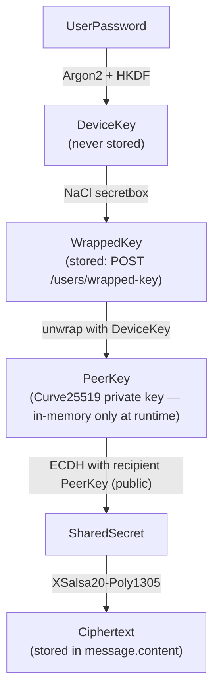
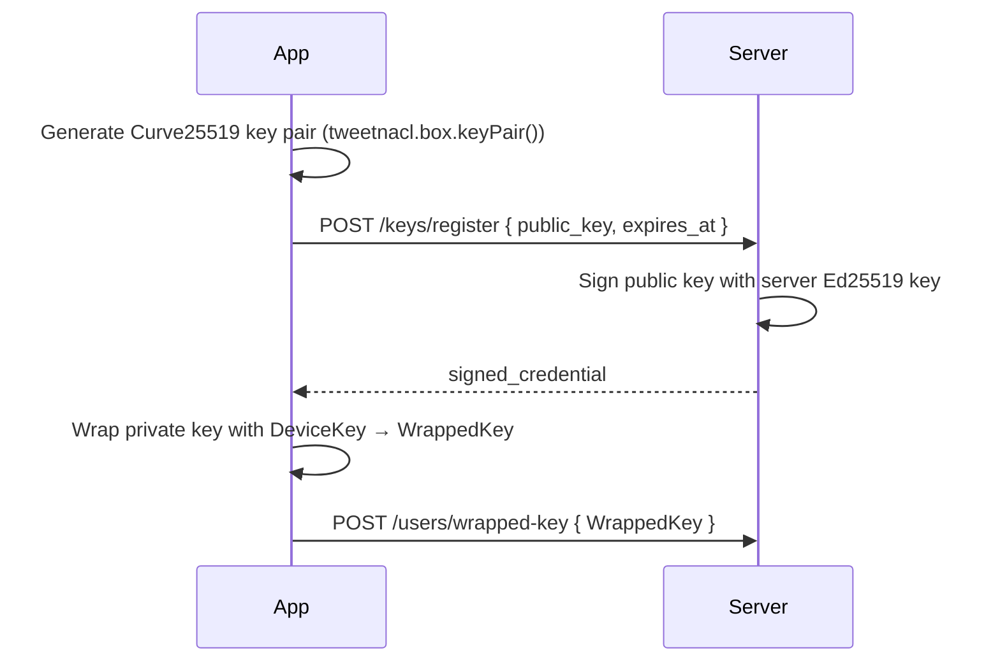
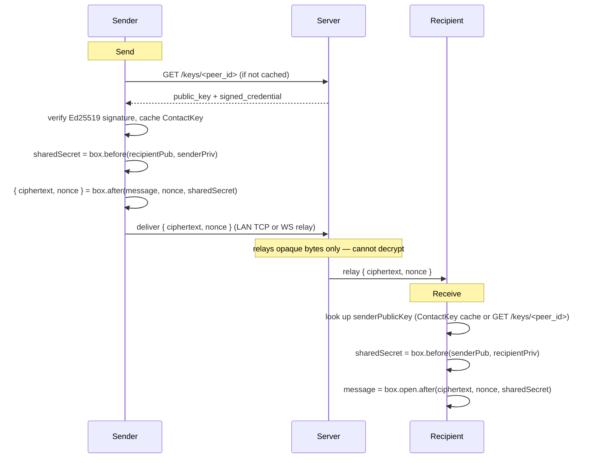

# E2E Encryption — Design

## Architecture

E2E encryption is implemented entirely in the mobile app (`mobile-app/sapot-mobile-app/features/shared/crypto/`). The server stores only public keys and wrapped (encrypted) private key blobs — it never sees plaintext.

### Key crypto files

| File | Responsibility |
|---|---|
| `peer-key-service.ts` | Key pair generation, registration, and server lookup |
| `key-derivation.ts` | DeviceKey derivation from password (Argon2) |
| `local-encryption-service.ts` | At-rest encryption of the private key |
| `tcp-encryption.ts` | NaCl box encryption/decryption for LAN TCP messages |
| `ws-encryption.ts` | NaCl box encryption/decryption for WebSocket relay messages |
| `key-recovery-service.ts` | Wrapping/unwrapping keys for recovery methods |

### Crypto libraries

- `tweetnacl` — NaCl box (Curve25519 ECDH + XSalsa20-Poly1305)
- `@noble/hashes` — Argon2 and HKDF for key derivation
- `expo-crypto` — Secure random number generation
- `react-native-quick-crypto` — Native crypto acceleration

---

## Key hierarchy

---

## Key registration flow

1. App generates Curve25519 key pair via `tweetnacl.box.keyPair()`.
2. Public key is sent to `POST /keys/register` along with `expires_at`.
3. Server signs the public key with its Ed25519 key and returns `signed_credential`.
4. App stores private key in memory; wraps it with DeviceKey and uploads as `WrappedKey`.

---

## Message encryption (send) and decryption (receive)

**Send:**
1. Look up recipient's public key: `GET /keys/<peer_id>`.
2. Verify server's Ed25519 signature on `signed_credential`.
3. Cache `ContactKey` (recipient's public key) locally.
4. Derive shared secret: `tweetnacl.box.before(recipientPublicKey, senderPrivateKey)`.
5. Encrypt: `tweetnacl.box.after(message, nonce, sharedSecret)`.
6. Store `{ ciphertext, nonce }` as `message.content`.

**Receive:**
1. Look up sender's public key from `ContactKey` cache or `GET /keys/<peer_id>`.
2. Derive shared secret: `tweetnacl.box.before(senderPublicKey, recipientPrivateKey)`.
3. Decrypt: `tweetnacl.box.open.after(ciphertext, nonce, sharedSecret)`.

---

## Key recovery wrapping

For each recovery method, a copy of the WrappedKey is re-encrypted under a key derived from the recovery credential and stored as `WrappedKeyRecovery`:

| Method | Recovery key derivation |
|---|---|
| Email OTP | Key derived from the OTP value |
| Phone OTP | Key derived from the SMS OTP value |
| Security question | Key derived from Argon2 hash of the answer |
| Recovery key file | Key derived from the file content |

On recovery, the user unlocks the appropriate `WrappedKeyRecovery`, retrieves the PeerKey private key, re-wraps it with a new DeviceKey, and uploads the new `WrappedKey`.

---

## Transport encryption

Both TCP and WebSocket transports apply NaCl box encryption at the message layer, independent of TLS:

- **LAN TCP** (`tcp-encryption.ts`): each message encrypted before writing to the TCP socket.
- **WebSocket relay** (`ws-encryption.ts`): each message encrypted before sending to the server relay — the server cannot read content even while routing it.

Encryption is applied identically regardless of transport mode (`lan`, `server`, or `auto` — see [messaging design](../messaging/design.md)): whether a message travels the P2P LAN data-channel path or the server-relay WebSocket path, the server only ever sees ciphertext.

---

## Security considerations

- The server never receives the DeviceKey or plaintext PeerKey private key.
- `SERVER_ED25519_SEED` being unset means public keys are unverified — MITM via key substitution is possible. Must be set in production.
- Nonces must be unique per message per key pair — use `crypto.getRandomValues()` for each nonce.

---

## Non-goals

- No forward secrecy across a conversation's lifetime — NaCl box uses static per-conversation keys, not a per-message ratchet. See [ADR 0001](../../adr/0001-nacl-box-for-e2e-encryption.md) for why the Signal Double Ratchet was not adopted.
- No user-facing key verification (safety numbers/QR comparison) — users cannot independently confirm a peer's public key out of band. See [threat-model.md](../../architecture/threat-model.md#e2e-encryption-design-risks).
- No encryption of message *metadata* (sender, recipient, timestamp) — only content is encrypted; the server can observe who is talking to whom and when.

## Failure handling

- **Decryption failure (wrong key, tampered ciphertext, or corrupted nonce):** `tweetnacl.box.open.after` returns `null` rather than throwing — calling code must treat `null` as "cannot decrypt" and surface a failed-message state, never a blank or default message.
- **`SERVER_ED25519_SEED` unset:** public key signatures are absent; the app should still function (unsigned keys are still usable for encryption) but any future key-verification UI must clearly flag unsigned keys as unverified rather than treating them the same as signed ones.
- **Recipient's public key unavailable** (offline server, not yet registered): message send fails at the encryption step, before any network call — the app should surface this distinctly from a network-transport failure.
- **Recovery blob unwrap failure** (wrong recovery input): `unwrapKeyBundle` returns `null` — see [account-recovery design](../account-recovery/design.md#failure-handling) for the resulting user-facing flow.

## Performance impact

- NaCl box (Curve25519 + XSalsa20-Poly1305) is fast enough for per-message encryption on mobile hardware — encryption/decryption cost is not a bottleneck relative to network or DB I/O for typical chat message sizes.
- `tweetnacl.box.before()` (ECDH shared-secret derivation) is the more expensive step; it is cached per-peer (`ContactKey`) rather than recomputed per message.
- Argon2/HKDF key derivation for wrapping (see [security-architecture.md](../../architecture/security-architecture.md#devicemaster-key-setup-password--wrapped-key)) is intentionally slow and happens only at key setup/recovery, not per-message.

## Scalability

- Per-conversation key model scales linearly with number of contacts, not number of messages — key lookups (`ContactKey` cache) are O(1) per peer after the first exchange.
- No server-side scalability concern: the server stores and serves opaque blobs (`PeerKey`, `WrappedKey`) with no decryption work of its own, so encryption load is entirely client-side and does not grow server resource needs with message volume.

## Acceptance criteria

- The server cannot decrypt message content under any code path — verified by the fact that `WrappedKey`/`WrappedKeyRecovery`/message ciphertext are the only key-adjacent data it stores.
- A message encrypted on one device is decryptable only by the intended recipient's registered key pair.
- Losing a recovery method (e.g. losing the recovery key file) does not brick the account if at least one other recovery method is configured.
- Tampering with ciphertext or nonce in transit causes decryption to fail closed (return `null`/error), never silently return corrupted plaintext.
