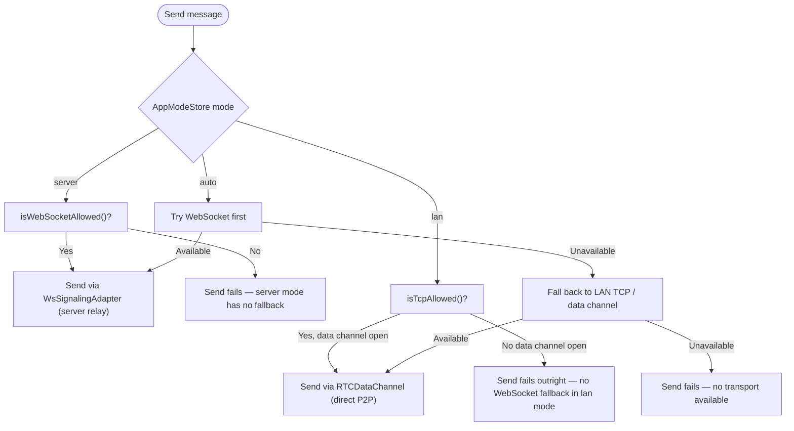
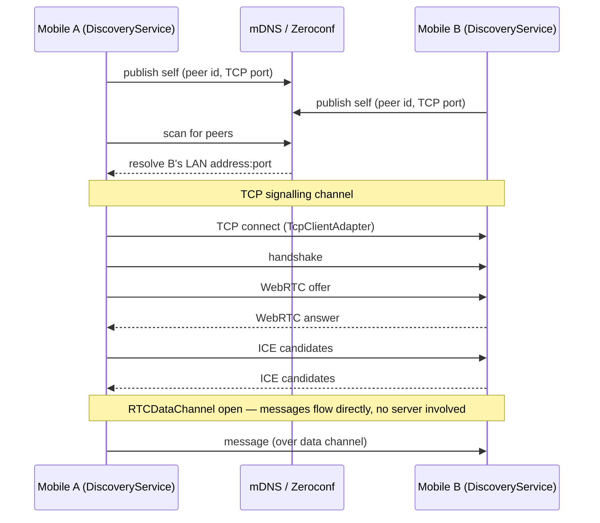
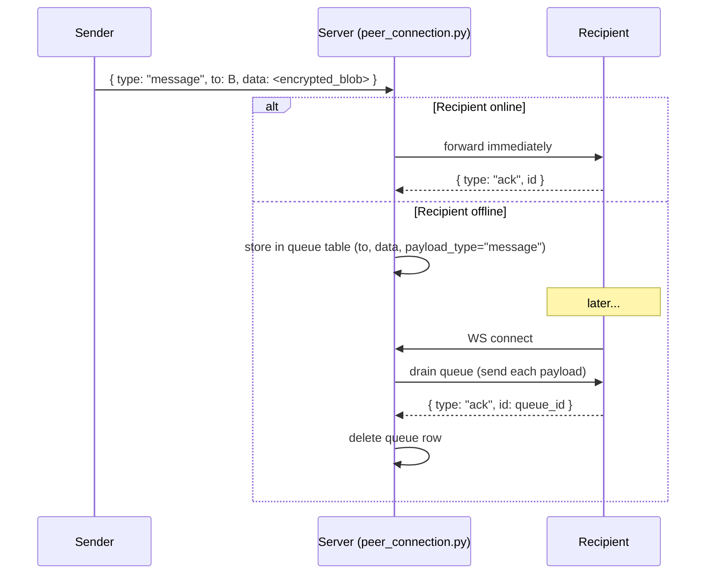

# Messaging — Design

## Architecture

Messaging spans two layers:
- **Mobile:** `ChatService` handles message send/receive and persistence to WatermelonDB.
- **Server:** `peer_connection.py` handles WebSocket relay, offline queue, and ack processing.

---

## Mobile — ChatService

`features/shared/connection/services/ChatService` is responsible for:
- Encrypting outbound messages via `tcp-encryption.ts` or `ws-encryption.ts`.
- Writing messages to WatermelonDB immediately on send.
- Routing messages through the active transport (`ConnectionService`).
- Decrypting and persisting inbound messages.

### Transport selection (via ConnectionService)

`ConnectionService` operates in three modes, driven by `AppModeStore`. Mode is P2P (`lan`), server-mediated (`server`), or a hybrid that prefers P2P (`auto`):

| Mode | Behaviour | P2P or server-mediated |
|---|---|---|
| `auto` | WebSocket first, TCP fallback | Hybrid — prefers server relay, falls back to LAN P2P |
| `server` | WebSocket relay only | Server-mediated |
| `lan` | LAN TCP only | P2P |

Guards in `ConnectionService` — `isWebSocketAllowed()` and `isTcpAllowed()` — check `AppModeStore` plus guest status before selecting a transport.



#### `lan` mode: peer discovery and transport

In `lan` mode, messages travel entirely over a direct WebRTC data channel between peers on the same local network — the server is never involved in message delivery:

1. **Discovery** — `DiscoveryService` publishes this device and scans for peers via mDNS/Zeroconf (`ZeroconfAdapter`, wrapping `react-native-zeroconf`). Each peer is published with its TCP listen port and peer ID in the Zeroconf TXT record.
2. **TCP signalling** — Once a peer is discovered, `ConnectionService` opens a `TcpClientAdapter` connection to the peer's advertised IP/port and exchanges a handshake, then a WebRTC offer/answer, then ICE candidates — all over TCP.
3. **Data channel** — Once the WebRTC connection is established, messages are sent over the resulting `RTCDataChannel`. `lan` mode has no WebSocket fallback: if the data channel is not open, sending fails outright.

See `mobile-app/sapot-mobile-app/docs/LAN_MESSENGER.md` for the full discovery → TCP → WebRTC → data channel sequence, and `mobile-app/sapot-mobile-app/docs/ARCHITECTURE.md` ("Transport Modes") for the mode table.



---

## Server — WebSocket relay (`peer_connection.py`)

### Inbound message routing

When the server receives `{ type: "message", to: <user_id>, data: <encrypted_blob> }`:
1. Checks whether `to` is in the active WebSocket connections.
2. **Online:** forwards immediately to the target connection.
3. **Offline:** stores in the `queue` table (`to`, `data`, `payload_type = "message"`).

### Queue drain on reconnect

When a user establishes a WebSocket connection:
1. Server fetches all `queue` rows where `to = user_id`.
2. Sends each payload to the now-connected client.
3. Waits for `{ type: "ack", id: <queue_id> }`.
4. On ack: deletes the queue row.



### Public chat

`{ type: "public-chat", content: <encrypted_blob> }` is broadcast to all connected users. History stored and returned by `GET /public-chat`.

---

## Message sync

Messages created locally are pushed to the server via `POST /sync/push`. The server stores them in MariaDB for cross-device sync.

**P2P receipt guard:** `MessageReceipt` rows for LAN-TCP-only messages are rejected by the sync endpoint — those messages were never server-routed, so server-side receipt rows would create orphaned FK references.

---

## Data model (mobile — WatermelonDB)

```
conversations       id, type, created_at, updated_at, is_deleted
  └── messages      id, conversation_id, sender_id, content (encrypted blob)
        └── message_receipts  id, message_id, user_id, status
        └── attachments       id, message_id, filename, mime_type
```

Messages are keyed by UUID generated on the mobile device. The same UUID is used when pushing to the server, enabling idempotent upserts.

---

## SMS fallback

For users without the app, a rescuer can use `POST /gsm/send` to send an SMS via the GSM module. The recipient receives plain-text SMS — E2E encryption does not apply to SMS.

---

## Non-goals

- No group messaging beyond the existing `conversations`/`conversation_participants` model's support — this design covers 1:1 and public chat; multi-party private group chat UX is out of scope here.
- No message editing after send — `messages` supports soft delete (`is_deleted`) but not content mutation; a "corrected" message is a new message, not an edit of the original.
- `lan` mode has no WebSocket fallback by design (see [Transport selection](#transport-selection-via-connectionservice)) — this is an accepted constraint, not a gap to fix.
- SMS fallback is plaintext by necessity (SMS has no E2E channel) — this is a deliberate, documented exception to the E2E-encryption default, not an oversight.

## Failure handling

- **Recipient offline (server mode):** the server stores the encrypted payload in the `queue` table and delivers it on the recipient's next WebSocket connection — see [Queue drain on reconnect](#queue-drain-on-reconnect). No message is dropped as long as the sender's push to the server succeeds.
- **`lan` mode with no open data channel:** sending fails outright with no fallback — the mobile app must surface this as a distinct failed-send state rather than silently queuing (per [Transport selection](#transport-selection-via-connectionservice)).
- **Ack never received for a queued message:** the queue row is never deleted, so the payload is redelivered on the recipient's *next* reconnect too — this makes delivery at-least-once, not exactly-once; the client's local UUID-based idempotent upsert (see [Data model](#data-model-mobile--watermelondb)) is what prevents duplicate display.
- **Orphaned `MessageReceipt` for a LAN-only message:** rejected by the sync push endpoint's FK guard rather than silently accepted, preventing referential-integrity corruption (see [P2P receipt guard](#message-sync)).
- **Decryption failure on receive:** see [e2e-encryption design](../e2e-encryption/design.md#failure-handling) — the message is persisted but flagged as undecryptable, never discarded.

## Performance impact

- Encryption/decryption cost per message is negligible relative to network/DB I/O — see [e2e-encryption performance impact](../e2e-encryption/design.md#performance-impact).
- `auto` mode's "WebSocket first, TCP fallback" behavior means a healthy LAN P2P path avoids server relay entirely, reducing server load and message latency (single network hop vs. two) whenever direct peer connectivity is available.
- The offline `queue` table read on reconnect is a single indexed query by `to = user_id`; drain cost scales with the number of messages queued while the recipient was offline, not with total system message volume.

## Scalability

- Server-relayed messaging load scales with the number of *offline* deliveries and public-chat broadcast fan-out, not with total message volume — LAN-mode P2P messages never touch the server at all (see [ADR 0005](../../adr/0005-lan-first-design.md)).
- Public chat broadcasts to all connected users — this is O(n) per message in the number of currently-connected users, which is acceptable at LAN incident-site scale but would not scale to a large multi-site deployment without partitioning.
- The `queue` table could grow unboundedly if a recipient never reconnects (e.g. lost/destroyed device) — no expiry or pruning policy exists for abandoned queue rows today.

## Acceptance criteria

- A message sent while the recipient is offline (server mode) is delivered once they reconnect, without duplication.
- A message sent via LAN P2P never appears in server-side storage in decryptable form — only ciphertext, if it appears at all.
- SMS-fallback messages are clearly distinguished in the UI from E2E-encrypted app messages, so users understand the confidentiality difference.
