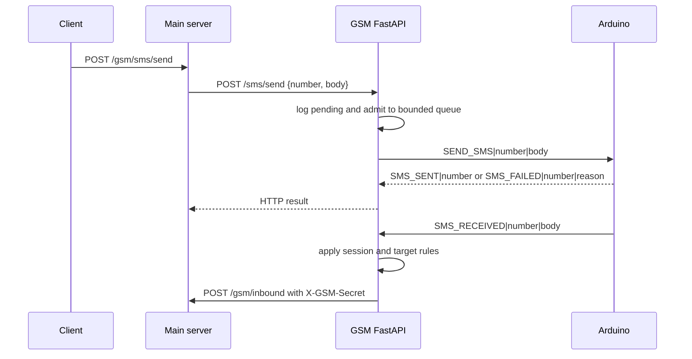

# SMS Gateway: Design

## Overview

The SMS gateway connects SAPOT to an Arduino-controlled GSM modem. The main server sends HTTP requests to the GSM FastAPI service, which serializes outbound SMS commands over USB. Inbound modem events travel back through the GSM service to the main server.

The deployed implementation is `GSM-module/GSM-fastapi/`. The parallel `GSM-module/GSM-API/` directory is incomplete and is not part of this design.

## Why is the gateway a separate service?

Serial communication is stateful and permits only one outbound command at a time. Keeping it outside the main server gives one process ownership of the serial port and prevents concurrent HTTP requests from interleaving modem commands.

The boundary also lets the main server remain available when the modem disconnects. The gateway reports readiness and delivery failures without making GSM hardware a dependency of the main API process.

## How do the components interact?



The main server authenticates the user-facing `/gsm/sms/send` route with a JSON Web Token (JWT). The GSM service normally listens on `127.0.0.1:8001` and translates trusted local HTTP calls into serial commands.

## How does outbound admission work?

`SerialWorker` owns a bounded first-in, first-out queue. `SMS_SEND_QUEUE_MAXSIZE` configures between 1 and 20 waiting requests, with a default of 10. One additional request may be active in the sender.

Admission uses `put_nowait()` while the lifecycle lock is held. A full queue raises `OutboundQueueFullError`, and `POST /sms/send` returns HTTP 503:

```json
{
  "detail": {
    "message": "Outbound SMS queue is full",
    "reason": "QUEUE_FULL",
    "msg_id": "<sms_log UUID>"
  }
}
```

The upper limit leaves worker threads available for overload responses and other synchronous FastAPI routes. `GET /health` is asynchronous, so liveness remains responsive while admitted sends wait for modem results.

## How is one SMS sent?

The sender owns one active request at a time:

1. Dequeue and register the request as active.
2. Wait for modem readiness up to the request timeout.
3. Atomically transition the request to in-flight while writing `SEND_SMS|<number>|<body>`.
4. Wait for `SMS_SENT` or `SMS_FAILED` from the reader thread.
5. Complete the matching caller and let the API update `sms_log`.

The serial connection has a five-second write timeout. Reader events cannot complete a request before its serial write begins. Queue depth excludes the active request.

Shutdown closes admission, drains waiting work, and resolves active work with `SERVICE_STOPPING`. This avoids blocking on a sentinel when the bounded queue is full.

## What is the serial protocol?

`GSM-fastapi/protocol.py` and the production Arduino firmware are the sources of truth.

```text
Python to Arduino:
  SEND_SMS|<number>|<body>\n

Arduino to Python:
  GSM_READY
  NETWORK_OK
  NETWORK_LOST
  SIM_MISSING
  SMS_RECEIVED|<number>|<body>\n
  SMS_SENT|<number>\n
  SMS_FAILED|<number>|<reason>\n
  LOG|<message>\n
```

Message bodies may contain pipe characters. `parse_line()` preserves them for `SMS_RECEIVED`. Newlines in outbound bodies are replaced with spaces by `build_send_sms()`.

## How are inbound messages handled?

The reader places `SMS_RECEIVED` events on `incoming_queue`. The API lifespan task passes each event to `handle_incoming_sms()`, which applies registration, ban, phone-verification, session, and target checks.

The handler can return a reply to the sender and a forwarded message for the selected target. Both use the same bounded outbound queue. `database.notify_app()` also calls the main server's `POST /gsm/inbound` route with `X-GSM-Secret`.

## What is persisted?

The GSM service uses the database configured by required `DB_PATH`.

| Table | Responsibility |
|---|---|
| `sms_log` | Inbound and outbound audit rows, delivery status, and failure reason |
| `sms_session` | Per-phone conversation stage and selected target |
| Shared user and conversation tables | Lookup and delivery integration with the main server |

The committed `sapot.db` file is stale and is not used by the deployed service.

## How are failures reported?

| Failure | Result |
|---|---|
| Queue at capacity | HTTP 503 with `QUEUE_FULL`; no serial write |
| Worker stopping | HTTP 503 with `SERVICE_STOPPING` |
| Serial port or modem unavailable before admission | HTTP 503 |
| Serial write error | HTTP 502 with a reason beginning `WRITE_ERROR:` |
| Modem reports failure or confirmation times out | HTTP 502 with the modem or timeout reason |
| Main server cannot reach the GSM service | Main server health route returns HTTP 503 |

The main server currently returns the GSM response body without preserving the upstream status from `POST /sms/send`. Callers using the main server route cannot rely on the gateway's 503 status until that proxy behavior is corrected.

## Security and deployment assumptions

- Set `DB_PATH` and `GSM_SECRET` in restricted environment files. Bare-metal systemd deployments use `/etc/sapot/gsm.env`.
- The main server checks `X-GSM-Secret` on inbound callbacks.
- The direct GSM service does not authenticate `/sms/send`; keep port 8001 restricted to the host or trusted Compose network.
- SMS content is plaintext on the carrier network and should not be treated as end-to-end encrypted.
- The design supports one serial modem. Multi-modem failover and bulk SMS are out of scope.
