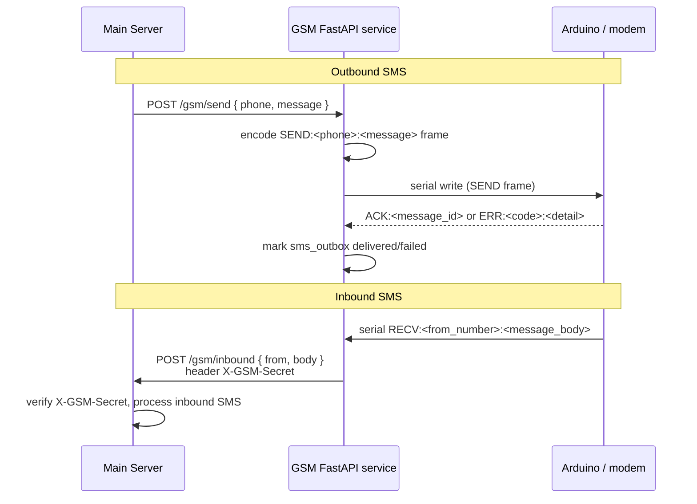
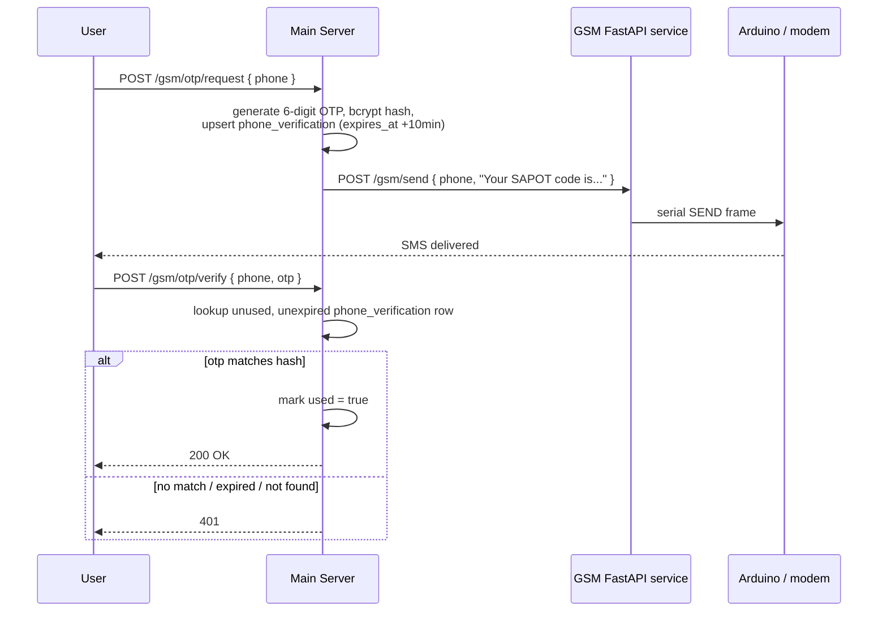

# SMS Gateway — Design

## Overview

The SMS gateway is a separate FastAPI microservice (`GSM-module/GSM-fastapi/`) that bridges the main server and an Arduino-based GSM module over a serial port. The main server calls the GSM API to send SMS; the Arduino forwards inbound SMS back to the main server via a webhook.

This feature is server-mediated; it has no P2P path.

---

## Architecture

```
Main Server (FastAPI)
  ├── POST /gsm/otp/request ──► generate OTP, store in phone_verification
  │                          └► POST /gsm/send ──────────────────────────────►┐
  │                                                                            │
  └── POST /gsm/inbound ◄── (webhook with X-GSM-Secret) ◄────────────────────┤
                                                                               │
                                                           GSM FastAPI Service │
                                                           GSM-module/GSM-fastapi/
                                                             ├── serial_worker.py
                                                             ├── sms_handler.py
                                                             └── protocol.py
                                                                    │ serial /dev/ttyACM0
                                                                    ▼
                                                             Arduino Uno
                                                             SIM800L / SIM900
```



---

## GSM FastAPI Service — `GSM-module/GSM-fastapi/`

### `serial_worker.py`

Owns the serial connection lifecycle:

- Opens `/dev/ttyACM0` at 9600 baud on startup.
- Runs a background thread that reads lines from the serial port.
- Forwards inbound lines to `sms_handler.handle_inbound(line)`.
- Exposes `serial_send(command: str)` for outbound AT commands.
- Reconnects automatically if the serial port closes unexpectedly.

### `protocol.py`

Defines the serial communication protocol between the GSM service and the Arduino:

```
Outbound (service → Arduino):
  SEND:<phone>:<message>\n

Inbound (Arduino → service):
  RECV:<from_number>:<message_body>\n
  ACK:<message_id>\n
  ERR:<code>:<detail>\n
```

The protocol layer encodes/decodes these frames and validates that all required fields are present before passing to the handler.

### `sms_handler.py`

Processes both directions:

**Outbound flow:**

```python
async def send_sms(phone: str, message: str) -> str:
    message_id = uuid4().hex
    frame = protocol.encode_send(phone, message, message_id)
    serial_worker.serial_send(frame)
    db.insert_pending(message_id, phone, message)
    return message_id  # returned to caller for tracking
```

**Inbound flow:**

```python
def handle_inbound(line: str):
    frame = protocol.decode(line)
    if frame.type == "RECV":
        # POST to main server webhook
        requests.post(
            f"{MAIN_SERVER_URL}/gsm/inbound",
            json={"from": frame.from_number, "body": frame.message_body},
            headers={"X-GSM-Secret": GSM_SECRET},
            timeout=5
        )
    elif frame.type == "ACK":
        db.mark_delivered(frame.message_id)
    elif frame.type == "ERR":
        db.mark_failed(frame.message_id, frame.detail)
```

### GSM FastAPI Routes

| Method | Path       | Description                            |
|--------|------------|----------------------------------------|
| POST   | /gsm/send  | Accept send request; enqueue via serial |
| GET    | /gsm/status| Return service health and serial state |

`/gsm/send` is called by the main server; it is not exposed to mobile clients directly.

### Storage — `sapot.db`

The GSM service uses a local SQLite database for outbox state:

| Table        | Purpose                                    |
|--------------|--------------------------------------------|
| sms_outbox   | Pending and delivered outbound messages    |
| sms_inbound  | Log of received inbound messages           |

In production, `DB_PATH` environment variable points to a MariaDB connection string to replace SQLite.

---

## Main Server — OTP Flow

### `POST /gsm/otp/request`

```python
otp = generate_otp(6)  # cryptographically random 6-digit string
expires_at = datetime.utcnow() + timedelta(minutes=10)
db.upsert(PhoneVerification(phone=phone, otp_hash=bcrypt(otp), expires_at=expires_at, used=False))
gsm_api.send(phone=phone, message=f"Your SAPOT code is {otp}. Valid for 10 minutes.")
```

`phone_verification` table:

| Column     | Type     | Notes                           |
|------------|----------|---------------------------------|
| id         | UUID     |                                 |
| phone      | string   | E.164 format                    |
| otp_hash   | string   | bcrypt hash; never store raw OTP|
| expires_at | datetime | UTC                             |
| used       | boolean  | Set true after successful verify|
| created_at | datetime |                                 |

### `POST /gsm/otp/verify`

```python
row = db.query(PhoneVerification).filter(
    phone=phone,
    used=False,
    expires_at > datetime.utcnow()
).order_by(created_at.desc()).first()

if not row or not bcrypt.check(otp, row.otp_hash):
    raise HTTPException(401)

row.used = True
db.commit()
```



### `POST /gsm/inbound` (Webhook)

```python
@router.post("/gsm/inbound")
async def receive_inbound(request: Request, payload: InboundSmsPayload):
    secret = request.headers.get("X-GSM-Secret")
    if secret != GSM_SECRET:
        raise HTTPException(401)
    # process inbound SMS: store, parse commands, etc.
```

`GSM_SECRET` is loaded from the environment at startup; the application refuses to start if it is not set.

---

## Webhook Authentication

```
GSM FastAPI service  ──POST /gsm/inbound──►  Main Server
                       X-GSM-Secret: <value>
```

- `GSM_SECRET` is a shared secret set as an environment variable on both services.
- The main server rejects any `/gsm/inbound` request where the header is absent or does not match.
- In production this secret should be at least 32 random bytes, base64-encoded.

---

## Rate Limiting

OTP endpoints use Slowapi on the main server:

| Endpoint              | Limit             |
|-----------------------|-------------------|
| `/gsm/otp/request`    | 1 per 60 s per IP |
| `/gsm/otp/resend`     | 1 per 60 s per IP |
| `/gsm/otp/verify`     | 5 per 60 s per IP |

---

## Dependencies

| Component              | Purpose                                       |
|------------------------|-----------------------------------------------|
| pyserial               | Serial port communication with Arduino        |
| FastAPI (GSM service)  | HTTP API for send/status endpoints            |
| SQLite / MariaDB       | GSM service outbox state                      |
| Slowapi                | Rate limiting on OTP endpoints (main server)  |
| bcrypt                 | OTP hashing in `phone_verification`           |

---

## Non-goals

- Not a two-way in-app messaging replacement — SMS is a fallback for OTP delivery and reaching users without the app installed, not a full-featured SMS inbox/thread UI.
- No multi-modem/multi-line support — the current design assumes a single serial-attached modem (`serial_worker.py` owns one connection); sending to multiple numbers concurrently is serialized through that one channel.
- No delivery-status UI beyond `db.mark_delivered`/`db.mark_failed` — there is no user-facing "message delivered/read" indicator for SMS, unlike in-app messages.
- Not encrypted — SMS content is plaintext by the nature of the SMS protocol; see [messaging design's SMS fallback note](../messaging/design.md#sms-fallback).

## Failure handling

- **Serial port closes unexpectedly:** `serial_worker.py` reconnects automatically; any AT command in flight when the port closes is presumed lost — `sms_handler.py`'s outbox (`sms_outbox` table, `pending`/`delivered`/`failed` states) is the source of truth for what still needs resending, but automatic resend of `pending` rows after a reconnect is not described in the current design — worth confirming as a follow-up.
- **`ERR` frame from the Arduino:** `handle_inbound` marks the corresponding outbox row `failed` with the modem's detail code — the main server's OTP flow surfaces this as an OTP-send failure rather than silently leaving the user waiting.
- **Webhook call to the main server fails** (network blip, main server down): `requests.post(...)` to `/gsm/inbound` has a 5s timeout; a failed webhook call means an inbound SMS is acknowledged to the modem but never reaches the main server — there is no retry/dead-letter queue for this today.
- **`GSM_SECRET` mismatch or missing:** the main server rejects the webhook with 401; the GSM service has no visibility into *why* it was rejected beyond the HTTP status.
- **GSM module fully unreachable from the main server:** phone OTP requests fail; per [account-recovery design](../account-recovery/design.md#failure-handling), other recovery/verification methods remain usable.

## Performance impact

- SMS delivery latency is bounded by the modem's own network round-trip (cellular network, typically seconds) — orders of magnitude slower than in-app message delivery; the OTP flow's 10-minute expiry window is sized to tolerate this.
- The serial channel is a single sequential bottleneck — `serial_send` calls queue behind whatever is currently in flight on `/dev/ttyACM0`, so send throughput is capped by modem + serial round-trip time, not by the FastAPI service itself.

## Scalability

- Designed for low SMS volume (OTPs and occasional fallback messages), not bulk SMS — a single serial-attached modem has a hard throughput ceiling unsuitable for high-volume sending.
- `sms_outbox`/`sms_inbound` grow unboundedly with no documented retention policy; the sqlite-vs-MariaDB storage note in [migrations.md](../../database/migrations.md#gsm-module-database-note) means production data must be in the MariaDB path, not the stale committed `sapot.db`.

## Acceptance criteria

- An OTP requested via `/gsm/otp/request` is delivered as an SMS and successfully verified via `/gsm/otp/verify` within its 10-minute validity window.
- An unauthenticated (`X-GSM-Secret` mismatch or missing) call to `/gsm/inbound` is rejected with 401 and has no side effects.
- A failed outbound send is reflected in `sms_outbox` as `failed`, not left indefinitely `pending`.
- OTP endpoints enforce their documented rate limits (`1 per 60s` for request/resend, `5 per 60s` for verify).
