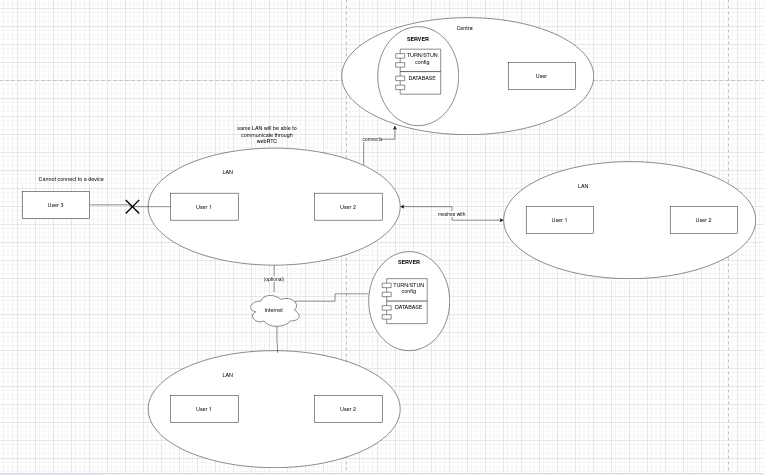
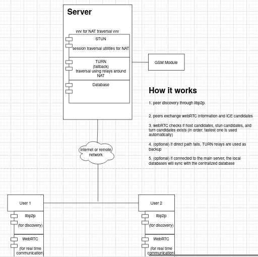
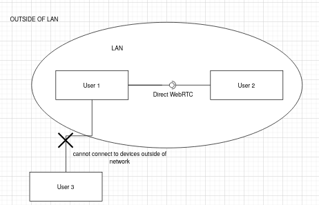
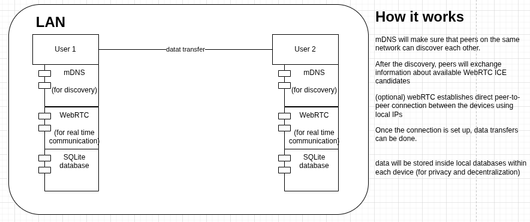

#+title: mobile app todo

* Briefing
** What is the mobile app for?
The mobile app will enable end-users to utilize any local network for messaging
(SMS or through LAN), voice calls, and video calls. The app will also be able to
utilize the server if it is connected to it

- +101%: we can add a meshing system to the mobile phones through the use of
  hotspot or bluetooth (tsaka na to kung matatapos tayo ng maaga)

** Features of the mobile application
- mode switching: can be auto-switch or manually select
- Decentralized (offline / through LAN)
  - peer discovery
  - direct webRTC
    - LAN messaging
    - LAN voice calls
    - LAN video calls
  - SQLite storage
  - no accounts only serialization/unique hashes (possible if maggenenerate ng
    unique identifier per device through libp2p)
  - push notifications
- with server
  - WebRTC via server
  - server discovery
  - SMS messaging
  - message persistence through centralized database
  - push notifications
  - assigns identity to users (through accounts)
  - server does not own keys (end-to-end communication)
- database of server and local database will sync when connected

** Possible challenges to encounter:
- local discovery of devices
- encryption of payloads
- keeping the privacy of users
- analytics on the server
- syncing of data
- identity of users

** What will be used to build the mobile app?
The following languages and frameworks will be used to create the application:
1. React native +necessary libraries
2. SQLite
3. WebRTC
4. (server) STUN and TURN Server

** Core principles of communication
The following principles should always be followed:
1. Identity
   - make sure that each sure is identifiable and verifiable in some way
2. Encryption and encoding
   - encrypt payloads, communication channels
   - encode messages in a way that is optimal (without compromising speed for security)
3. Discovery
   - discovery of other users
4. reliability
   - if the connection fails, what will happen?
     - Do messages retry?
     - Are they acknowledged?
     - Are they dropped?
     - Are they stored?
5. boundaries
   - blocking, restricting, etc

* Concept of the application
** Centralized architecture

** Centralized Specifics

** Decentralized Architecture

** Decentralized Specifics

* TODO
The following are the ordered breakdown of the things to accomplish for the completion
of the mobile application:
** Learn the following
- [ ] getting started with react native
- [ ] what is WebRTC and how to works
- [ ] what is libp2p and it's role in our architecture
- [ ] what is a STUN server
- [ ] what is a TURN server
- [ ] what is feature branch workflow (GIT) (read the collaboration guide)

** Build the following
- [ ]
