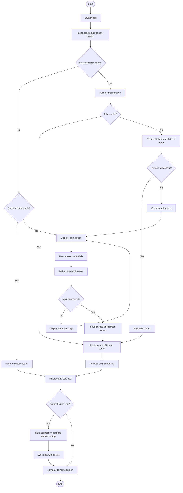

# System Startup and Authentication Flow

On launch, the SAPOT mobile application checks for a previously stored authentication session in local secure storage. If a valid token is found, the user profile is retrieved from the server; if the token has expired, a silent refresh is requested from the server, and failure to refresh forces the user to log in again. In the absence of any authenticated session, the app checks for an existing guest session and restores it directly without contacting the server. Upon successful authentication, GPS location streaming is activated and the app synchronizes its local data with the server before navigating to the home screen. Guest sessions bypass all server communication and proceed directly to the home screen in LAN-only mode.

> **To export:** Paste the Mermaid block into [mermaid.live](https://mermaid.live) and download as PNG or SVG for inclusion in the paper.

