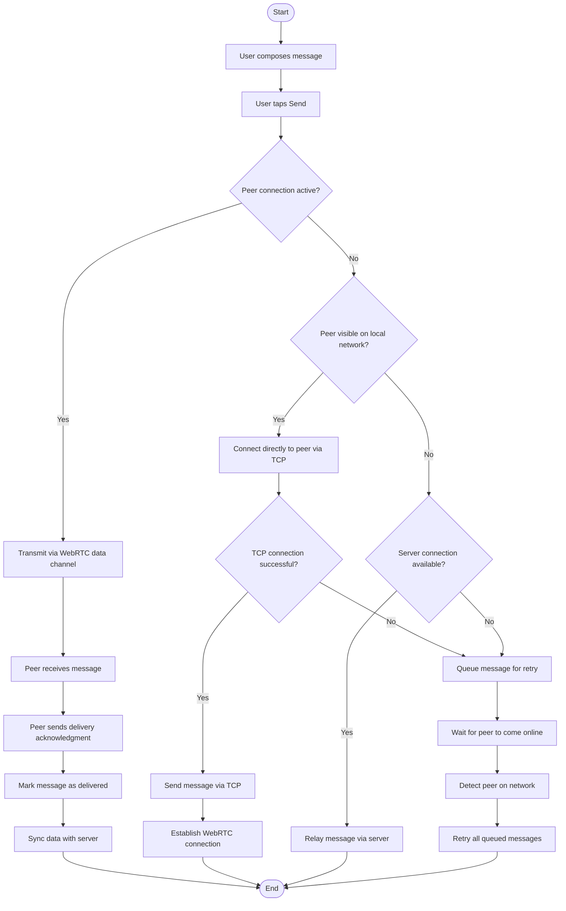

# LAN Messaging Flow

When a user sends a message, the mobile app selects the best available transport path in descending order of priority. If a direct peer-to-peer connection between the two devices is already active, the message is transmitted immediately without server involvement. If no direct connection exists, the app attempts to reach the recipient over the local area network via the router using a direct TCP link; if the recipient is unreachable on the LAN, the message is relayed through the central server over the network, or queued locally if the server is also unavailable. Once the recipient's device comes online, queued messages are retried and upon delivery the message record is synchronized with the server.

> **To export:** Paste the Mermaid block into [mermaid.live](https://mermaid.live) and download as PNG or SVG for inclusion in the paper.

