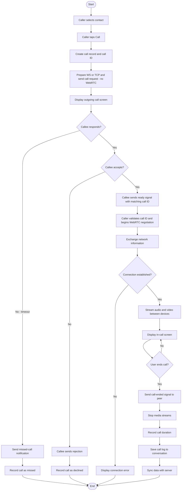

# Voice and Video Call Flow

A voice or video call is initiated when the caller's device sends a call request to the recipient through the network; if the recipient does not respond within the timeout window or declines, the call is recorded as missed or declined respectively. Upon acceptance, both devices exchange signaling messages through the network to negotiate a direct peer-to-peer media connection. Once established, audio and video stream directly between the two devices without passing through the central server. On call termination, the call duration is recorded and the call log is synchronized with the server.

> **To export:** Paste the Mermaid block into [mermaid.live](https://mermaid.live) and download as PNG or SVG for inclusion in the paper.

