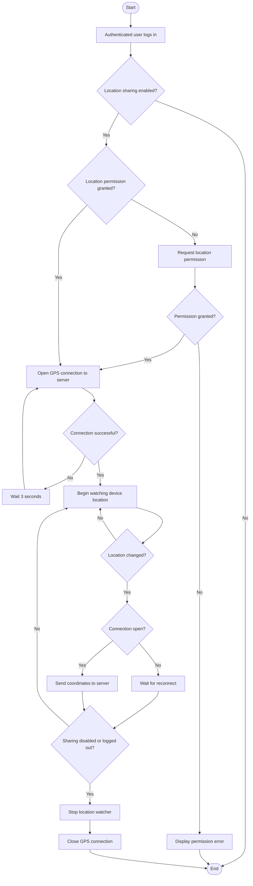
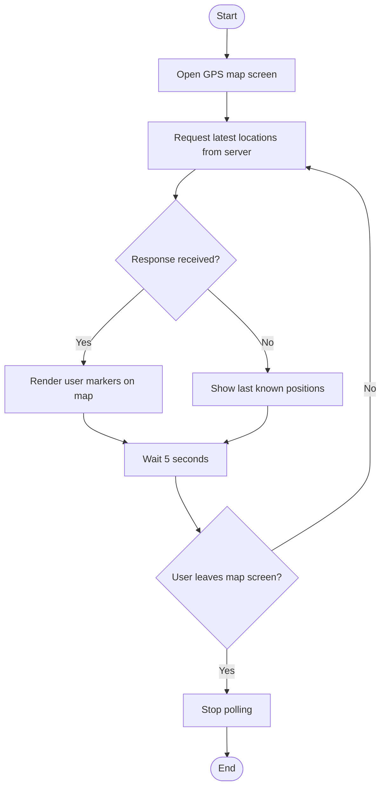

# GPS Location Sharing Flow

GPS location sharing in SAPOT operates through two complementary sub-flows for authenticated users. In the streaming sub-flow, the mobile app opens a dedicated connection to the server and continuously forwards the device's GPS coordinates whenever the position changes; if the connection is lost, the app reconnects automatically every three seconds. Streaming requires both the user's sharing preference to be enabled and the device's location permission to be granted by the operating system. In the viewing sub-flow, the map screen polls the server every five seconds for the latest positions of all sharing users and renders them as markers on the map, stopping when the user navigates away.

> **To export:** Paste the Mermaid block into [mermaid.live](https://mermaid.live) and download as PNG or SVG for inclusion in the paper.

## Sub-flow A — Streaming Location (Authenticated User)

## Sub-flow B — Viewing the Map (Authenticated User / Admin)

