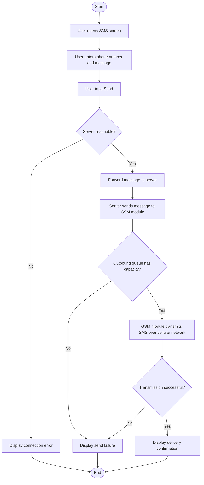
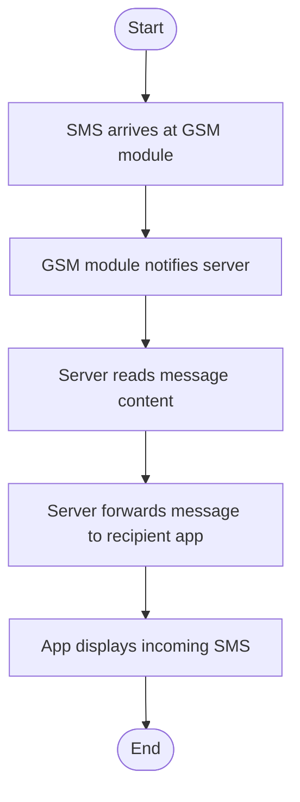

# SMS via GSM Module Flow

The SAPOT system enables SMS communication through a hardware bridge attached to the server node, consisting of a SIM-800L GSM module connected to the server via an Arduino UNO over a serial interface. In the send path, the mobile app forwards the outbound message and target phone number to the server over the local network; the server relays the payload to the GSM module via the Arduino, which transmits the SMS through the cellular network to the recipient's phone. A server-reachability check is performed before the request is forwarded — if the server is unreachable, the operation fails immediately. In the receive path, an incoming SMS at the GSM module triggers a notification to the server via the Arduino, after which the server delivers the message to the intended recipient's mobile app over the network.

> **To export:** Paste the Mermaid block into [mermaid.live](https://mermaid.live) and download as PNG or SVG for inclusion in the paper.

## Send Path

## Receive Path

