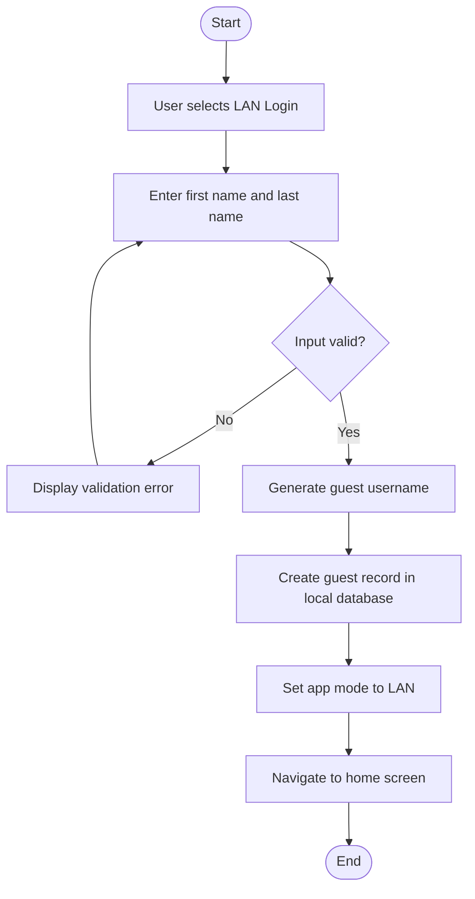
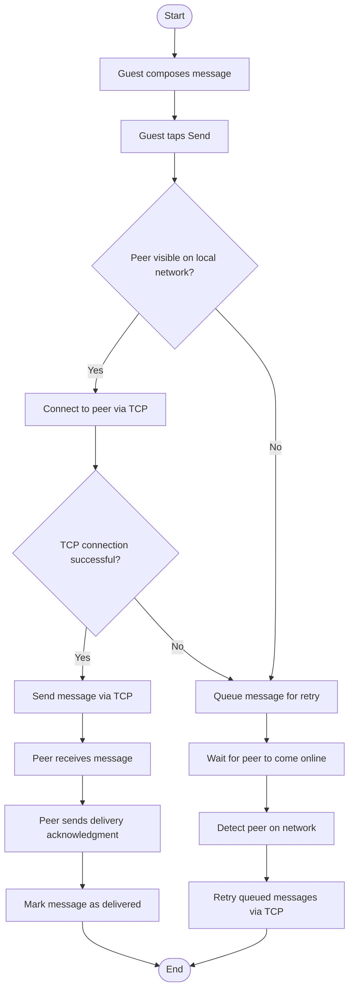
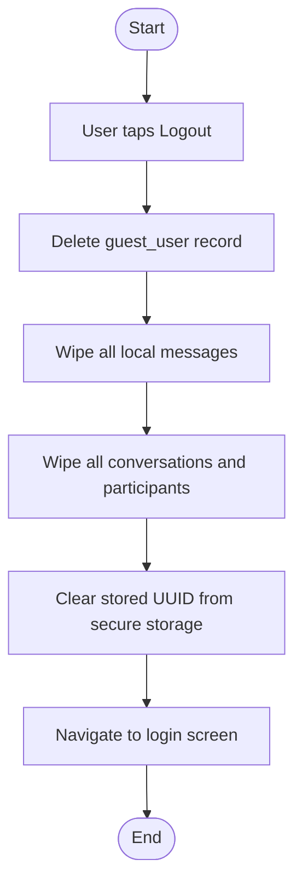
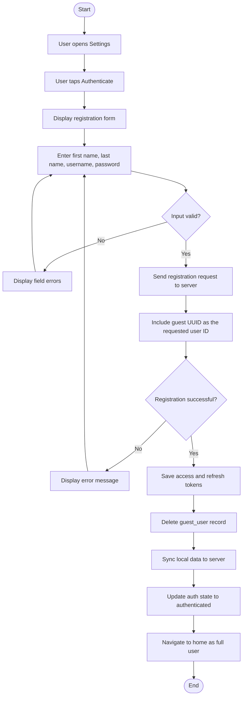

# Guest User Flow

Guest users access SAPOT without an account by providing only a first and last name; the app generates a username and a unique local identifier, storing the guest session entirely on the device without contacting the server. For the duration of the session, all communication is restricted to direct TCP connections between devices over the local area network via the router — server relay and peer-to-peer media channels are not available. On logout, all locally stored messages, conversations, and session data are permanently deleted from the device with no option for recovery. Should the guest elect to create a full account, the registration request is submitted to the server using the guest's existing local identifier as the assigned user ID, ensuring that all previously stored local data is automatically associated with the new account upon synchronization.

> **To export:** Paste the Mermaid block into [mermaid.live](https://mermaid.live) and download as PNG or SVG for inclusion in the paper.

## Sub-flow A — Guest Login

## Sub-flow B — Guest TCP Messaging

> Guest sessions use TCP only. WebRTC data channels, server relay, and server sync are not available.

## Sub-flow C — Guest Logout (Full Data Wipeout)

> All local data is permanently deleted. This action cannot be undone.

## Sub-flow D — Guest Account Migration

> The guest UUID is submitted as the desired server user ID. All local records are preserved with no re-mapping required.

