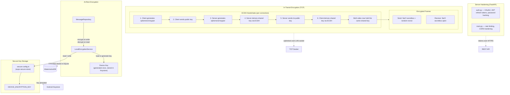

# Security Implementation

## Layer Summary

| Layer | Where | Mechanism | Key Files |
|---|---|---|---|
| At-rest | WatermelonDB messages | NaCl `secretbox`, device-scoped key | `local-encryption-service.ts`, `message-repository.ts` |
| In-transit | LAN TCP connections | ECDH ephemeral handshake + NaCl `secretbox` | `tcp-encryption.ts`, `tcp-client-adapter.ts`, `tcp-server-adapter.ts` |
| Key storage | Device keystore | `expo-secure-store` → Android Keystore | `secure-config.ts` |
| Server | FastAPI backend | OAuth2 JWT, rate limiting, CORS | `auth.py`, `main.py` |
