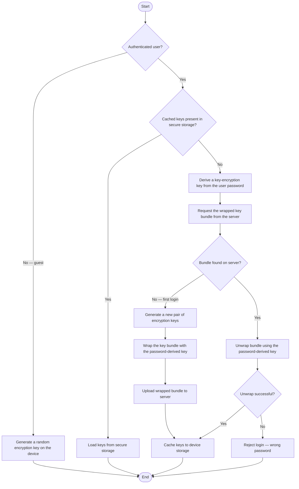
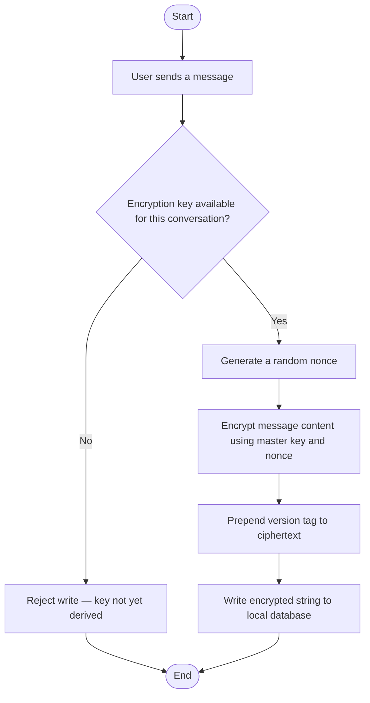
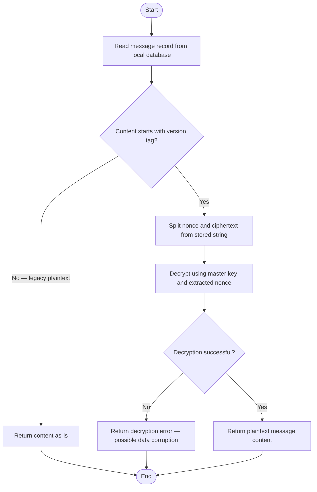
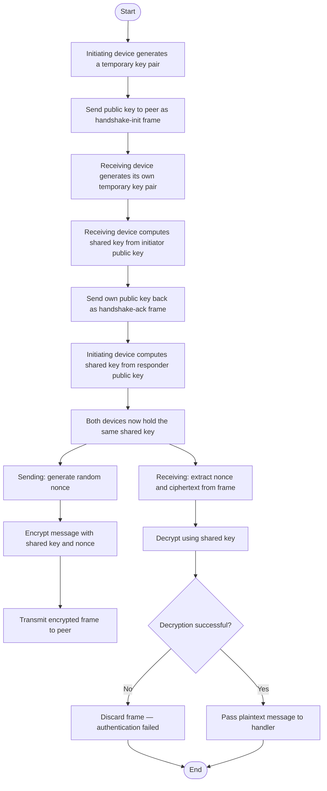
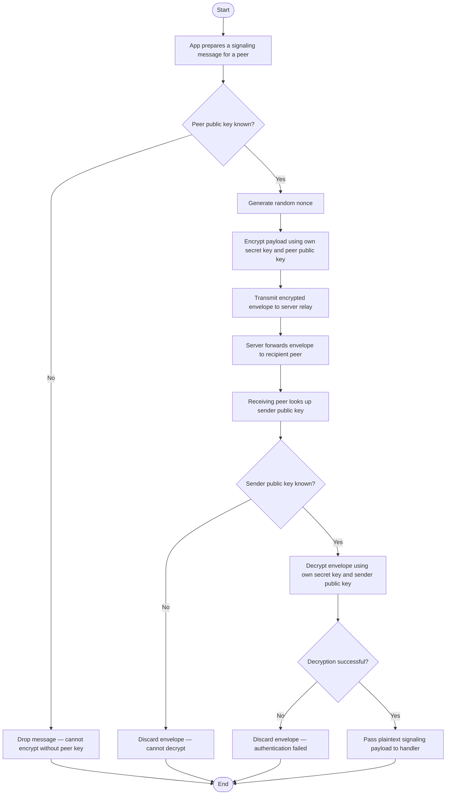

# Encryption and Decryption Flow

SAPOT encrypts data at two points: before writing messages to the local database, and before sending data over the network. The key that protects stored messages is derived from the user's password and retrieved from the server on each login; for guest users, a temporary key is generated on the device and discarded on logout. Network traffic between peers is protected by a separate handshake that produces a one-time shared key for each connection. WebSocket signaling messages use a static key pair unique to the user's account. All encryption uses the NaCl cryptographic library.

> **To export:** Paste the Mermaid block into [mermaid.live](https://mermaid.live) and download as PNG or SVG for inclusion in the paper.

## Sub-flow A — Key Initialization on Login

## Sub-flow B — Message Encryption (Write to Database)

## Sub-flow C — Message Decryption (Read from Database)

## Sub-flow D — TCP Connection Encryption (Per-Connection Handshake)

## Sub-flow E — WebSocket Signaling Encryption

